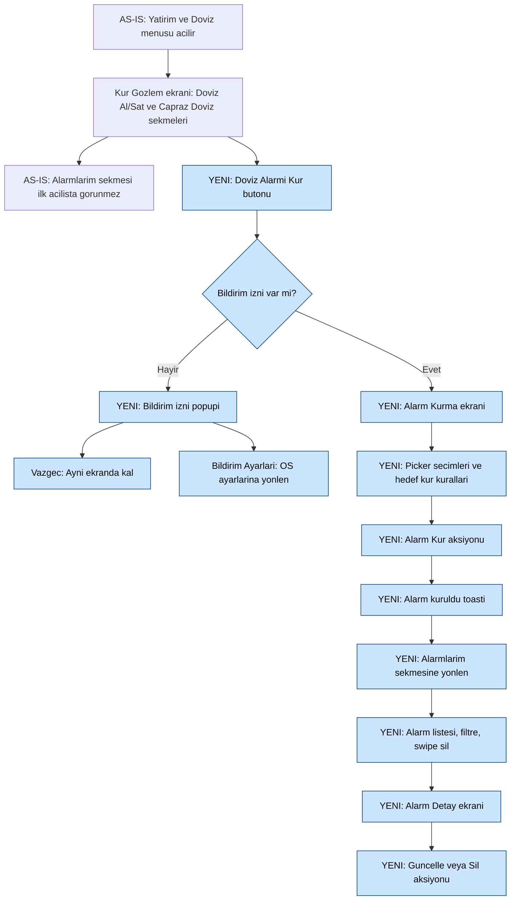

# [BELIRSIZ — kaynakta kod yok] Döviz Alarm — Architect Teknik Analiz Index
 
## Değişiklik Tarihçesi
 
| Tarih | Sürüm | Hazırlayan | Değişiklik |
|-------|-------|------------|------------|
| 10 Haziran 2026 | v1 | GitHub Copilot | İlk versiyon — SDLC çıktısından türetildi |
 
## 1. Genel Özet ve Hedef
 
Proje, mevcut Döviz Al/Sat ve Çapraz Döviz akışlarına alarm kurma, alarm listeleme-yönetimi, alarm detay güncelleme-silme ve bildirimden yönlenme yeteneklerini ekler. Bu index dokümanı iOS, Android ve mwbackend teknik analizlerini tek bir çapraz-platform sözleşmede toplar. Kaynak doküman `docs/mobile-sdlc-analiz.md` ve bu çalıştırmada üretilen platform dokümanlarıdır.
 
## 2. Doküman Haritası
 
| Doküman | Hedef Kitle | Yol |
|---------|-------------|-----|
| architect-index.md | Tech lead + tüm ekipler | docs/architect/architect-index.md |
| architect-ios.md | iOS developer | docs/architect/architect-ios.md |
| architect-android.md | Android developer | docs/architect/architect-android.md |
| architect-backend.md | mwbackend developer | docs/architect/architect-backend.md |
 
## 3. Etki Özeti (SDLC 3.4)
 
| Etki Alanı | Durum | Not |
|-------------|--------|-----|
| QNB Mobil Bireysel | Var | Döviz alarm akışı kapsamda |
| QNB Mobil Tüzel | Var | SDLC'de var olarak işaretli |
| IB / Enpara / CC / ATM / Web | Yok | SDLC'de kapsam dışı |
| SAS Fraud | Var | Teknik eşleştirme detayları [BELIRSIZ] |
| Chatbot | Var | Bilgilendirme aksiyonu gerekli |
| CMS | Var | 10 resource key tanımlı |
| Engelsiz Bankacılık | Yok | SDLC 3.4.2 |
| EBHS | Yok | SDLC 3.4.10 |
 
## 4. Yazılım İşlevleri Listesi (4.1.X)
 
| No | İşlev | iOS Etki | Android Etki | Backend Etki | Not |
|----|-------|----------|--------------|--------------|-----|
| 4.1.1 | Alarm Kurma Giriş ve İzin Kontrol | Var | Var | Kısıtlı | İzin kontrolü, popup |
| 4.1.2 | Alarm Kurma Ekranı | Var | Var | Var | Create akışı |
| 4.1.3 | Alarmlarım Listeleme ve Yönetim | Var | Var | Var | List + Delete |
| 4.1.4 | Alarm Detay, Güncelleme ve Silme | Var | Var | Var | Update + Delete |
| 4.1.5 | Bildirim ve Yönlenme | Var | Var | Var | PN + deep link |
 
## 5. Cross-Platform REST Endpoint Matrisi
 
Not: SDLC'de endpoint adları açık verilmediği için aşağıdaki adlar naming convention'a göre öneridir.
 
| Endpoint | Method | Backend Handler | iOS Service | Android Repository | Durum |
|----------|--------|------------------|-------------|---------------------|-------|
| /api/currency-alarms | POST | CreateCurrencyAlarmHandler | CurrencyAlarmService.create(req:) | CurrencyAlarmRepository.create(req) | [BELIRSIZ — yeni] |
| /api/currency-alarms | GET | ListCurrencyAlarmsHandler | CurrencyAlarmService.list() | CurrencyAlarmRepository.list() | [BELIRSIZ — yeni] |
| /api/currency-alarms/{id} | PUT | UpdateCurrencyAlarmHandler | CurrencyAlarmService.update(id:req:) | CurrencyAlarmRepository.update(id, req) | [BELIRSIZ — yeni] |
| /api/currency-alarms/{id} | DELETE | DeleteCurrencyAlarmHandler | CurrencyAlarmService.delete(id:) | CurrencyAlarmRepository.delete(id) | [BELIRSIZ — yeni] |
 
## 6. Resource Key Haritası
 
| ResourceKey | tr-TR | en-US | ar-SA | iOS | Android | Backend |
|-------------|-------|-------|-------|-----|---------|---------|
| CurrencyAlarmPermissionRequiredMessage | Bildirim izniniz bulunmuyor... | [ÇEVİRİ GEREKLİ] | [ÇEVİRİ GEREKLİ] | Localizable.strings popup | strings.xml popup | Hata metni/iş kuralı |
| CurrencyAlarmPermissionCancelButton | Vazgeç | [ÇEVİRİ GEREKLİ] | [ÇEVİRİ GEREKLİ] | Popup button | Dialog negative | - |
| CurrencyAlarmPermissionSettingsButton | Bildirim Ayarları | [ÇEVİRİ GEREKLİ] | [ÇEVİRİ GEREKLİ] | Popup button | Dialog positive | - |
| CurrencyAlarmInfoMessage | Kur seviyesi hedef kura ulaştığında... | [ÇEVİRİ GEREKLİ] | [ÇEVİRİ GEREKLİ] | Banner | Info text | - |
| CurrencyAlarmCreateSuccessToast | Alarmınızı kurduk. | [ÇEVİRİ GEREKLİ] | [ÇEVİRİ GEREKLİ] | Toast | Toast | - |
| CurrencyAlarmUpdateSuccessToast | Alarmınızı güncelledik | [ÇEVİRİ GEREKLİ] | [ÇEVİRİ GEREKLİ] | Toast | Toast | - |
| CurrencyAlarmDeleteConfirmMessage | Alarmı silmek istediğinize emin misiniz? | [ÇEVİRİ GEREKLİ] | [ÇEVİRİ GEREKLİ] | Alert | Dialog | - |
| CurrencyAlarmDeleteSuccessToast | Alarmı sildiniz | [ÇEVİRİ GEREKLİ] | [ÇEVİRİ GEREKLİ] | Toast | Toast | - |
| CurrencyAlarmEmptyStateMessage | Alarmınız bulunmuyor. | [ÇEVİRİ GEREKLİ] | [ÇEVİRİ GEREKLİ] | Empty state | Empty state | - |
| CurrencyAlarmAutoDeleteInfoMessage | Alarmlarınız gerçekleştiğinde... | [ÇEVİRİ GEREKLİ] | [ÇEVİRİ GEREKLİ] | Banner | Info text | - |
 
## 7. Loglama Event Sözlüğü
 
Not: SDLC derinleştirme kararında TrackMobileEvent için Hayır işaretlidir; aşağıdaki event isimleri platformlar arası analitik sözlüğü için öneri niteliğindedir.
 
| Event | iOS | Android | Backend |
|------|-----|---------|---------|
| currency_alarm_entry_tap | Dataroid | Dataroid | VpDefaultLog |
| currency_alarm_created | Dataroid | Dataroid | VpDefaultLog + EDW extra field |
| currency_alarm_updated | Dataroid | Dataroid | VpDefaultLog + EDW extra field |
| currency_alarm_deleted | Dataroid | Dataroid | VpDefaultLog + EDW extra field |
| currency_alarm_pn_open | Push deep link handler | Push deep link handler | [BELIRSIZ — backend event enrichment] |
 
## 8. Pilot ve MinBuildNumber Konfigürasyonu
 
| Parametre | Değer |
|-----------|-------|
| PilotKey | [BELIRSIZ — netleşecek] |
| ReversePilot | false |
| MinBuildNumber iOS | 290 |
| MinBuildNumber Android | 300 |
| MinBuildNumber Huawei | 300 |
| Force Update | Hayır |
 
## 9. Sprint Koordinasyon Sırası
 
1. mwbackend endpoint sözleşmesi ve DTO taslağı netleştirilir.
2. iOS/Android network katmanları mock endpoint ile paralel geliştirilir.
3. mwbackend MCS ve transaction tanımları tamamlanır.
4. iOS/Android UI + validasyon + loglama tamamlanır.
5. DB scriptleri (resource/menu/transaction) mobile-05 ile üretilir ve uygulanır.
6. UAT ve pilot rollout yapılır.
 
## 10. Bilinmeyenler ve Belirsizlikler
 
| # | Konu | Sahip |
|---|------|-------|
| 1 | Proje kodu | BA |
| 2 | PilotKey | Ürün + teknik lider |
| 3 | Döviz alarmı MCS TransactionName tam listesi | Backend + MCS |
| 4 | HPC değeri | HPC ekibi |
| 5 | smg form code / template referansı | SMG |
| 6 | en-US ve ar-SA çevirileri | Çeviri ekibi |
 
## 11. Master DoD
 
- Endpoint matrisi üç platformda birebir aynı.
- Resource key seti üç platformda aynı mantıksal adlarla bağlı.
- MinBuild ve pilot kontrolleri her platformda test edildi.
- EDW extra field logları backend'de doğrulandı.
- UAT testleri tamamlandı.
- docs/architect/.review.md kritik bulgu içermiyor.
 
 
# [BELIRSIZ — kaynakta kod yok] Döviz Alarm — mwbackend Teknik Analiz
 
## Değişiklik Tarihçesi
 
| Tarih | Sürüm | Hazırlayan | Değişiklik |
|-------|-------|------------|------------|
| 10 Haziran 2026 | v1 | GitHub Copilot | SDLC + semantic-search tabanlı mwbackend teknik analiz |
 
## 1. Bağlam ve Kapsam
 
Bu doküman SDLC 4.1.2-4.1.5 için backend tarafında gerekli DDD katmanlarını, endpoint sözleşmesini ve MCS/DB etkilerini tanımlar. 4.1.1 tarafında backend etkisi sınırlıdır (izin kontrolü client side).
 
## 2. Etkilenen Modül / Klasör Haritası
 
| Yol | Sorumluluk | Durum |
|-----|------------|-------|
| mwbackend/MobileBanking/Application/MobileBanking.Feature.Treasure/... | Treasure feature DDD katmanları | Mevcut emsal |
| mwbackend/MobileBanking/Application/MobileBanking.Feature.Treasure/AssetsDebts/UseCase/AssetsDebtsUseCase.cs | UseCase emsali | Mevcut emsal |
| mwbackend/Source/Presentation/.../FxHelper/MobileFxHelper.cs | TransactionNameConstants pattern emsali | Mevcut emsal |
| mwbackend/.../CurrencyAlarm/... | Alarm feature alt alanı | [BELIRSIZ — yeni oluşturulacak] |
| MCSVeribranchBI/.../RequestTransactionData.cs | Request type include listesi | Kısmi emsal |
| MCSVeribranchBI/.../ResponseTransactionData.cs | Response type include listesi | Kısmi emsal |
 
## 3. Yapılacak İşler — İşlev Bazında
 
### 3.1 4.1.2 Alarm Kurma Ekranı (Create)
 
#### 3.1.1 Mevcut durum
- UseCase pattern: `AssetsDebtsUseCase`.
- Transaction çağrı pattern: `MobileFxHelper` içinde `TransactionNameConstants + Execute/Fetch`.
 
#### 3.1.2 Eklenecek/değişecek dosyalar
| Dosya | Değişiklik |
|------|------------|
| mwbackend/.../CurrencyAlarm/Controller/CurrencyAlarmController.cs | [BELIRSIZ — yeni] POST endpoint |
| mwbackend/.../CurrencyAlarm/Handler/CreateCurrencyAlarmHandler.cs | [BELIRSIZ — yeni] |
| mwbackend/.../CurrencyAlarm/UseCase/CurrencyAlarmUseCase.cs | [BELIRSIZ — yeni] |
| mwbackend/.../CurrencyAlarm/Service/CurrencyAlarmService.cs | [BELIRSIZ — yeni] |
| mwbackend/.../CurrencyAlarm/Model/CreateCurrencyAlarmRequest.cs | [BELIRSIZ — yeni] |
| mwbackend/.../CurrencyAlarm/Model/CreateCurrencyAlarmResponse.cs | [BELIRSIZ — yeni] |
 
#### 3.1.3 Endpoint
- POST /api/currency-alarms
 
#### 3.1.4 MCS ve Transaction
| Alan | Değer |
|------|-------|
| TransactionName | [BELIRSIZ — SDLC'de açık listelenmedi] |
| RequestType | [BELIRSIZ] |
| ResponseType | [BELIRSIZ] |
| HPC | [BELIRSIZ — HPC ekibi atayacak] |
 
#### 3.1.5 Pseudocode
1. Request validasyonu.
2. Döviz çifti ve tarih iş kuralları.
3. MCS create çağrısı.
4. Response map.
5. EDW log alanları set edilir.
 
#### 3.1.6 Hata/edge-case
- aynı döviz seçimi: BusinessException
- hedef kur geçersiz: BusinessException
- timeout: retriable hata map'i
- MCS boş yanıt: teknik hata map'i
 
### 3.2 4.1.3 Alarmlarım Listeleme ve Yönetim (List + Delete)
 
#### 3.2.1 Endpoint
- GET /api/currency-alarms
- DELETE /api/currency-alarms/{id}
 
#### 3.2.2 DDD değişiklikleri
- ListCurrencyAlarmsHandler, DeleteCurrencyAlarmHandler
- UseCase içinde filtre/sıralama dönüşümü
 
#### 3.2.3 Hata/edge-case
- boş liste: success + empty state bilgisi
- silme yetki kontrolü: ownership validation
 
### 3.3 4.1.4 Alarm Detay, Güncelleme ve Silme (Update + Delete)
 
#### 3.3.1 Endpoint
- PUT /api/currency-alarms/{id}
- DELETE /api/currency-alarms/{id}
 
#### 3.3.2 DDD değişiklikleri
- UpdateCurrencyAlarmHandler
- Detay dönüş modeli
 
#### 3.3.3 Hata/edge-case
- değişiklik yoksa no-op response
- geçmiş tarih update denemesi engellenir
 
### 3.4 4.1.5 Bildirim ve Yönlenme
 
#### 3.4.1 Endpoint/entegrasyon
- PN tetikleme noktası alarm gerçekleşme event'i sonrası.
- Push payload içeriği [BELIRSIZ — Notification feature sözleşmesi gerekli].
 
#### 3.4.2 Erişim noktaları
- Menü aramada Alarmlarım sekmesine yönlendirme için MobileMenu/MobileMenuMapping etkisi.
 
## 4. Ortak Değişiklikler
 
### 4.1 Transaction sabitleri
- `TransactionNameConstants` içine alarm create/list/update/delete sabitleri eklenecek. [BELIRSIZ]
 
### 4.2 DB etkisi (şema doğrulandı)
| Tablo | Durum | Not |
|------|-------|-----|
| MobileMenu | Doğrulandı | yeni/düzenlenen menü kaydı |
| MobileMenuMapping | Doğrulandı | erişim noktası mapping |
| VpStringResource | Doğrulandı | 10 key x 3 dil |
| VpTransaction | Doğrulandı | transaction tanımı |
| VpTransactionConfig | Doğrulandı | XML config |
| VpTransactionAttributes | Doğrulandı | HPC/OTP/log parametreleri |
| VpHostCallMappingDetail | Doğrulandı | MCS parametre mapping |
 
Not: veri seviyesinde SQL read aracı bu oturumda mevcut değildi, bu nedenle kayıt içerikleri [BELIRSIZ].
 
### 4.3 Loglama
- VpDefaultLog, VpExceptionLog, VpMobileContactHistory tabloları doğrulandı.
- EDW extra field ihtiyacı var (SDLC 4.3.1).
 
## 5. Pilot ve Versiyon Konfigürasyonu
 
| Parametre | Değer |
|-----------|-------|
| PilotKey | [BELIRSIZ] |
| ReversePilot | false |
| iOS MinBuild | 290 |
| Android MinBuild | 300 |
| Huawei MinBuild | 300 |
 
## 6. Bağımlılık Sırası
 
1. Endpoint/DTO sözleşmesi finalize edilir.
2. Handler/UseCase/Service katmanları geliştirilir.
3. Transaction/MCS tanımları tamamlanır.
4. DB scriptleri uygulanır.
5. UAT ve client entegrasyonu tamamlanır.
 
## 7. Definition of Done — mwbackend
 
- Endpoint sözleşmesi yayınlandı.
- DDD katmanları tamamlandı.
- Unit + integration testler geçti.
- TransactionNameConstants güncellendi.
- VpTransaction/VpStringResource/MobileMenu scriptleri uygulandı.
- EDW extra field logları doğrulandı.
 
## 8. Callers / Regresyon Analizi
 
| Değiştirilen Öğe | Çağıranlar | Regresyon Riski | Not |
|------------------|-----------|-----------------|-----|
| CurrencyExchange benzeri Treasure akışları | [BELIRSIZ — symbol usage taraması eksik] | Orta | Döviz ekranı mevcut akışı etkilenebilir |
| Notification yönlendirme zinciri | [BELIRSIZ] | Orta | PN route çakışması riski |
 
## 9. Açık Konular
 
1. Alarm transaction adları.
2. HPC değeri.
3. MCS request/response kesin alan listesi.
4. Push payload şeması.
 
 
# [BELIRSIZ — kaynakta kod yok] Döviz Alarm — iOS Teknik Analiz
 
## Değişiklik Tarihçesi
 
| Tarih | Sürüm | Hazırlayan | Değişiklik |
|-------|-------|------------|------------|
| 10 Haziran 2026 | v1 | GitHub Copilot | SDLC + semantic-search tabanlı iOS teknik analiz |
 
## 1. Bağlam ve Kapsam
 
Bu doküman, SDLC 4.1.1-4.1.5 işlevlerini iOS implementasyon seviyesine indirir. Proje mevcut döviz gözlem/işlem ekranlarını koruyarak alarm deneyimi ekler. iOS tarafında temel emsal zincir FeatureTreasure modülündeki döviz akışıdır.
 
## 2. Etkilenen Modül / Klasör Haritası
 
| Yol | Sorumluluk | Durum |
|-----|------------|-------|
| ios/FeatureTreasure/FeatureTreasure/Presenter/Form/Factory/ControllerFactory/FeatureTreasureControllerFactory.swift | Ekran injection/factory | Mevcut emsal |
| ios/FeatureTreasure/FeatureTreasure/Presenter/Form/Scenes/CurrencyExchange/View/CurrencyExchangeViewController.swift | Döviz işlem ekranı | Mevcut emsal |
| ios/MobileCore/MobileCore/Common/Permissions/NotificationPermissionViewController.swift | Bildirim izin akışı | Mevcut emsal |
| ios/FeatureTreasure/.../CurrencyAlarm... | Döviz alarm ekranları | [BELIRSIZ — yeni oluşturulacak] |
| ios/.../Localizable.strings (tr/en/ar) | Metin kaynakları | Değişecek |
 
## 3. Yapılacak İşler — İşlev Bazında
 
### 3.1 4.1.1 Alarm Kurma Giriş ve İzin Kontrol İşlevi
 
#### 3.1.1 Mevcut durum
- Döviz giriş ekranı emsali `CurrencyExchangeViewController`.
- İzin popup akışı emsali `NotificationPermissionViewController`.
 
#### 3.1.2 Eklenecek/değişecek dosyalar
| Dosya | Değişiklik |
|------|------------|
| ios/FeatureTreasure/.../CurrencyExchangeViewController.swift | Döviz Alarmı Kur butonu aksiyonu eklenecek |
| ios/FeatureTreasure/.../CurrencyAlarmEntryCoordinator.swift | [BELIRSIZ — yeni] izin kontrol + yönlendirme |
 
#### 3.1.3 Yeni/Değişen metodlar
| Sınıf | Metod | Sorumluluk |
|------|-------|------------|
| CurrencyExchangeViewController | didTapCurrencyAlarmButton() | İzin kontrol akışını başlatır |
| CurrencyAlarmEntryCoordinator | checkNotificationPermissionAndRoute() | İzin varsa create ekranına, yoksa popup'a yönlendirir |
 
#### 3.1.4 Resource key kullanımı
- CurrencyAlarmPermissionRequiredMessage
- CurrencyAlarmPermissionCancelButton
- CurrencyAlarmPermissionSettingsButton
 
#### 3.1.5 Endpoint koordinasyonu
- Bu adımda backend çağrısı yok, yalnızca ekran yönlendirmesi var.
 
#### 3.1.6 UI yerleşimi
- Döviz Al/Sat ve Çapraz Döviz ekranlarında mevcut işlem alanı altına buton.
 
#### 3.1.7 Validasyon
- Alan validasyonu yok.
 
#### 3.1.8 Loglama
- currency_alarm_entry_tap
- currency_alarm_permission_popup_shown
 
#### 3.1.9 Pilot/MinBuild
- PilotKey [BELIRSIZ].
- iOS min build 290 altında buton gizli.
 
#### 3.1.10 Test noktaları
- İzin açık/kapalı senaryoları.
- Vazgeç ve Bildirim Ayarları aksiyonları.
 
### 3.2 4.1.2 Alarm Kurma Ekranı İşlevi
 
#### 3.2.1 Mevcut durum
- Emsal ekran: CurrencyExchange tab yapısı ve picker pattern'leri.
 
#### 3.2.2 Eklenecek/değişecek dosyalar
| Dosya | Değişiklik |
|------|------------|
| ios/FeatureTreasure/.../CurrencyAlarmCreateViewController.swift | [BELIRSIZ — yeni] |
| ios/FeatureTreasure/.../CurrencyAlarmCreateViewModel.swift | [BELIRSIZ — yeni] |
| ios/FeatureTreasure/.../CurrencyAlarmService.swift | [BELIRSIZ — yeni] |
| ios/FeatureTreasure/.../Model/CurrencyAlarmCreateRequest.swift | [BELIRSIZ — yeni] |
 
#### 3.2.3 Metod düzeyi pseudocode
- validate form
- POST /api/currency-alarms çağrısı
- başarılıysa toast + Alarmlarım sekmesine yönlen
- hatada popup göster
 
#### 3.2.4 Resource key
- CurrencyAlarmInfoMessage
- CurrencyAlarmCreateSuccessToast
 
#### 3.2.5 Endpoint
- POST /api/currency-alarms
 
#### 3.2.6 UI
- Döviz picker (alış/satış), reverse butonu, hedef kur, bitiş tarihi.
 
#### 3.2.7 Validasyon
- Aynı döviz seçilemez.
- Hedef kur > 0.
- Bitiş tarihi geçmiş olamaz.
 
#### 3.2.8 Loglama
- currency_alarm_create_submit
- currency_alarm_created
 
#### 3.2.9 Pilot
- Pilot kapalıysa ekran açılmaz.
 
#### 3.2.10 Test
- aynı döviz popup
- timeout/retry
- başarı toast
 
### 3.3 4.1.3 Alarmlarım Listeleme ve Yönetim İşlevi
 
#### 3.3.1 Mevcut durum
- Liste + filtre + swipe emsali: Feature legacy list ekran pattern'leri.
 
#### 3.3.2 Eklenecek/değişecek dosyalar
| Dosya | Değişiklik |
|------|------------|
| ios/FeatureTreasure/.../CurrencyAlarmListViewController.swift | [BELIRSIZ — yeni] |
| ios/FeatureTreasure/.../CurrencyAlarmListCell.swift | [BELIRSIZ — yeni] |
| ios/FeatureTreasure/.../CurrencyAlarmListViewModel.swift | [BELIRSIZ — yeni] |
 
#### 3.3.3 Endpoint
- GET /api/currency-alarms
- DELETE /api/currency-alarms/{id}
 
#### 3.3.4 Resource key
- CurrencyAlarmDeleteConfirmMessage
- CurrencyAlarmDeleteSuccessToast
- CurrencyAlarmEmptyStateMessage
- CurrencyAlarmAutoDeleteInfoMessage
 
#### 3.3.5 Loglama
- currency_alarm_list_view
- currency_alarm_delete_confirm
- currency_alarm_deleted
 
### 3.4 4.1.4 Alarm Detay, Güncelleme ve Silme İşlevi
 
#### 3.4.1 Eklenecek/değişecek dosyalar
| Dosya | Değişiklik |
|------|------------|
| ios/FeatureTreasure/.../CurrencyAlarmDetailViewController.swift | [BELIRSIZ — yeni] |
| ios/FeatureTreasure/.../CurrencyAlarmDetailViewModel.swift | [BELIRSIZ — yeni] |
 
#### 3.4.2 Endpoint
- PUT /api/currency-alarms/{id}
- DELETE /api/currency-alarms/{id}
 
#### 3.4.3 Resource key
- CurrencyAlarmUpdateSuccessToast
- CurrencyAlarmDeleteConfirmMessage
- CurrencyAlarmDeleteSuccessToast
 
#### 3.4.4 Loglama
- currency_alarm_detail_view
- currency_alarm_updated
 
### 3.5 4.1.5 Bildirim ve Yönlenme İşlevi
 
#### 3.5.1 Eklenecek/değişecek dosyalar
| Dosya | Değişiklik |
|------|------------|
| ios/.../PushNotificationHandler.swift | Alarm deep link case eklenecek |
| ios/.../MenuSearchRouting.swift | Alarmlarım yönlendirmesi eklenecek |
 
#### 3.5.2 Endpoint/servis
- PN payload backend tarafından üretilir. [BELIRSIZ — payload şeması]
 
#### 3.5.3 Loglama
- currency_alarm_triggered_pn
- currency_alarm_pn_open
 
## 4. Ortak Değişiklikler
 
- Localizable.strings (tr/en/ar) 10 key güncellemesi.
- Döviz modülü coordinator/router katmanına alarm yönlendirmesi.
- Deep link çözümleyicide alarm route tanımı.
 
## 5. Pilot ve Versiyon Konfigürasyonu
 
| Konu | Değer |
|------|-------|
| PilotKey | [BELIRSIZ] |
| MinBuild iOS | 290 |
| ReversePilot | false |
 
## 6. Bağımlılık Sırası
 
1. Backend endpoint sözleşmesi netleşir.
2. iOS service + model katmanı tamamlanır.
3. ViewController/ViewModel ekranları tamamlanır.
4. PN/deep link entegrasyonu tamamlanır.
 
## 7. Test ve Doğrulama Notları
 
- TC-MOB-CURRENCY-ALARM-IOS-* senaryoları.
- tr/en/ar metin doğrulaması.
- MinBuild ve pilot aç/kapa testleri.
- Timeout ve servis hata senaryoları.
 
## 8. Definition of Done — iOS
 
- Kod review tamamlandı.
- Unit/UI testleri geçti.
- Resource key senkronu tamamlandı.
- Pilot/min build doğrulandı.
- Log event'leri analitikte görüldü.
 
 
# [BELIRSIZ — kaynakta kod yok] Döviz Alarm
## İŞ ANALİZİ DOKÜMANI (ÜRÜN DOKÜMANTASYONU)
 
---
 
## Değişiklik Tarihçesi
 
| Tarih | Sürüm | Değişikliği Yapan | Değişiklik |
|-------|-------|---------------------|------------|
| 02 Haziran 2026 | v1 | GitHub Copilot | Doküman oluşturuldu. |
 
---
 
## İçindekiler
 
1. Proje Genel Tanımı ve Amacı
2. Terimler ve Kısaltmalar
3. Müşteri Gereksinimleri
   - 3.1 Gereksinimler
   - 3.2 Genel Süreç Akışı
   - 3.3 Kapsama Alınmayan Müşteri Gereksinimleri
   - 3.4 Etki ve Risk Analizi
      - 3.4.1 Kanal (ADK) Etkisi
      - 3.4.2 Engelsiz Bankacılık Etkisi
      - 3.4.3 SAS Fraud Etkisi
      - 3.4.4 Chatbot Etkisi
      - 3.4.5 CMS (Content Management System) Etkisi
      - 3.4.6 TTS (OSDEM-SDY) ve DYS (FOMER) Etkisi
      - 3.4.7 MDYS Tanımları
      - 3.4.8 Mevzuata Uyum
      - 3.4.9 Anomali Takibi
      - 3.4.10 Mobil ve IB Uygulamaları EBHS Etkisi
4. Yazılımın Fonksiyonel Gereksinimleri
   - 4.1 Yazılım İşlevleri
   - 4.2 Muhasebe, Dekont, Alındılar ve Sistem Mizan
   - 4.3 Log ve EDW Rapor Gereksinimleri
      - 4.3.1 Ürün İşlem / Müşteri / ADK / Kullanıcı / Arcsight / Teftiş log + EDW Extra Field + Contact History
      - 4.3.2 EDW Raporları
   - 4.4 Ürün ve Ürün İşlem Tanım Gereksinimleri
5. Yazılımın Fonksiyonel Olmayan Gereksinimleri
   - 5.1 Performans, Kapasite ve Erişilebilirlik
   - 5.2 Güvenlik ve Veri Gizliliği
   - 5.3 Güvenilirlik ve Yedeklilik (Kötü Durum Senaryoları)
   - 5.4 Erişim ve Kimlik Yönetimi
   - 5.5 İç Sistemler (Teftiş Kurulu, Hukuk, Yasal Uyum ve İç Kontrol, Risk Yönetimi, IBT PQRM) Görüşü
 
---
 
## 1. Proje Genel Tanımı ve Amacı
 
Döviz Alarm geliştirmesi, QNB Mobil uygulamasında mevcut Döviz ve Kıymetli Maden İşlemleri akışına alarm yönetimi yeteneği eklemeyi amaçlamaktadır. Kapsam metnine göre kullanıcı, Döviz Al/Sat ve Çapraz Döviz sekmelerinden alarm kurma akışına geçebilmekte; alarm kurma, güncelleme, silme, listeleme ve alarm detay adımlarını tek bir müşteri yolculuğunda yönetebilmektedir. Bu iş, geliştirme tipi açısından mevcut ek iş kapsamındadır ve mevcut kur gözlem ekranı üzerine yeni işlevlerin kontrollü olarak eklenmesini içermektedir.
 
Analiz kapsamı; bildirim izni kontrolü ve izin yoksa popup akışı, alarm kurma ekranındaki picker/kur/tarih davranışları, Alarmlarım sekmesinin ilk alarmdan sonra görünür olması, alarm listesi filtreleme ve sıralama kuralları, swipe ile silme, alarm detay ekranında güncelleme/silme süreçleri, alarm gerçekleşme veya bitiş sonrası otomatik silme davranışı, push notification ile yönlenme ve arama üzerinden Alarmlarım sekmesine ulaşım gereksinimlerini kapsamaktadır. Kapsam dokümanında proje kodu bilgisi yer almadığı için bu alan [BELIRSIZ — kaynakta kod yok] olarak işaretlenmiştir.
 
---
 
## 2. Terimler ve Kısaltmalar
 
| Kısaltma / Terim | Açıklama |
|-------------------|----------|
| AS-IS | Mevcut durumda uygulamadaki çalışan akışın tanımıdır. |
| TO-BE | Geliştirme sonrası hedeflenen yeni akışın tanımıdır. |
| Popup | Kullanıcı aksiyonunu bekleyen ve akışı kesen uyarı penceresidir. |
| Toast | Ekran üzerinde kısa süre görünen ve otomatik kaybolan bilgilendirme mesajıdır. |
| Bottom Sheet | Ekranın altından açılan ve seçim yaptıran panel bileşenidir. |
| Picker | Kullanıcının listeden değer seçmesini sağlayan seçim bileşenidir. |
| Push Notification (PN) | Uygulama dışındayken de kullanıcıya gönderilen bildirim mesajıdır. |
| Deep Link | Bildirime veya aramaya tıklanınca uygulama içinde ilgili ekrana doğrudan yönlendirme sağlayan bağlantıdır. |
| Çapraz Döviz | TL içermeyen iki yabancı para birimi arasındaki parite işlemidir (örnek: EUR/USD). |
 
---
 
## 3. Müşteri Gereksinimleri
 
### 3.1 Gereksinimler
 
| Müşteri Gereksinimi | İlişkili Yazılım Gereksinimi |
|---------------------|--------------------------------|
| Döviz Al/Sat ve Çapraz Döviz sekmelerinde Döviz Alarmı Kur butonu ile alarm kurma akışına giriş sağlanmalıdır. | 4.1.1 Alarm Kurma Giriş ve İzin Kontrol İşlevi |
| Bildirim izni yoksa kullanıcıya popup gösterilmeli; Vazgeç ile ekranda kalınmalı, Bildirim Ayarları ile sistem ayarına yönlenmelidir. | 4.1.1 Alarm Kurma Giriş ve İzin Kontrol İşlevi |
| Alarm kurma ekranında alınacak/satılacak döviz seçimi, reverse butonu, hedef kur ve alarm bitiş tarihi kuralları uygulanmalıdır. | 4.1.2 Alarm Kurma Ekranı İşlevi |
| Aynı döviz seçimi, işleme kapalı döviz çifti ve hedef kur koşulları için uyarı kuralları uygulanmalıdır. | 4.1.2 Alarm Kurma Ekranı İşlevi |
| İlk alarm oluşturulduktan sonra Alarmlarım sekmesi açılmalı; listeleme, filtreleme, sıralama ve boş durum davranışları yönetilmelidir. | 4.1.3 Alarmlarım Listeleme ve Yönetim İşlevi |
| Alarmlar swipe ile silinebilmeli; silme onayı ve sonuç mesajı doğru akışla gösterilmelidir. | 4.1.3 Alarmlarım Listeleme ve Yönetim İşlevi |
| Alarm detay ekranında hedef kur ve bitiş tarihi güncellenebilmeli; Alarmı Güncelle butonu değişiklik sonrası aktifleşmelidir. | 4.1.4 Alarm Detay, Güncelleme ve Silme İşlevi |
| Alarm gerçekleştiğinde push notification gönderilmeli; bildirime tıklanınca ilgili döviz işlem ekranına yönlenme sağlanmalıdır. | 4.1.5 Bildirim ve Yönlenme İşlevi |
| Menü aramasında döviz alarmı aratıldığında kullanıcı Döviz ve Kıymetli Maden İşlemleri menüsünün Alarmlarım sekmesine yönlenmelidir. | 4.1.5 Bildirim ve Yönlenme İşlevi |
 
### 3.2 Genel Süreç Akışı
 

 
### 3.3 Kapsama Alınmayan Müşteri Gereksinimleri
 
Kapsama alınmayan gereksinim bulunmamaktadır.
 
### 3.4 Etki ve Risk Analizi
 
Etki analizi POTA Impact Analysis sayfasında bulunur: [BELIRSIZ — POTA linki paylaşılmadı]
 
#### 3.4.1 Kanal (ADK) Etkisi
 
| Kanal | Etki Durumu | Not |
|-------|-------------|-----|
| QNB Mobil — Bireysel | Var | Döviz Alarm akışı bireysel müşteriler için kapsamda yer almaktadır. |
| QNB Mobil — Tüzel | Var | Kullanıcı kararı doğrultusunda tüzel mobil müşteri için de etki bulunmaktadır. |
| QNB İnternet Bankacılığı (IB) | Yok | Kapsam dokümanında IB için ekran veya işlem etkisi tanımlanmamıştır. |
| Enpara | Yok | Kapsam dokümanında Enpara kanalına etki belirtilmemiştir. |
| Çağrı Merkezi (CC) | Yok | Kapsam dokümanında çağrı merkezi entegrasyonu yer almamaktadır. |
| ATM | Yok | Kapsam dokümanında ATM kanal etkisi yer almamaktadır. |
| Web Şubesi | Yok | Kapsam dokümanında web şubesi kanal etkisi yer almamaktadır. |
 
#### 3.4.2 Engelsiz Bankacılık Etkisi
 
Internet veya Mobil uygulamalara etkisi yoktur.
 
#### 3.4.3 SAS Fraud Etkisi
 
SAS Fraud etkisi vardır. Mapping ve teknik alan eşleme detayları developer analiz dokümanında ele alınacaktır.
 
#### 3.4.4 Chatbot Etkisi
 
Chatbot etkisi bulunmaktadır. Analiz onayı sonrasında OZL DB ChatBot Apps BA ekibine bilgilendirme yapılacaktır.
 
#### 3.4.5 CMS (Content Management System) Etkisi
 
| Key | tr-TR | en-US | ar-SA |
|-----|-------|-------|-------|
| CurrencyAlarmPermissionRequiredMessage | Bildirim izniniz bulunmuyor. Dilerseniz bildirim izni verdikten sonra alarm kurabilirsiniz. | [ÇEVİRİ GEREKLİ] | [ÇEVİRİ GEREKLİ] |
| CurrencyAlarmPermissionCancelButton | Vazgeç | [ÇEVİRİ GEREKLİ] | [ÇEVİRİ GEREKLİ] |
| CurrencyAlarmPermissionSettingsButton | Bildirim Ayarları | [ÇEVİRİ GEREKLİ] | [ÇEVİRİ GEREKLİ] |
| CurrencyAlarmInfoMessage | Kur seviyesi hedef kura ulaştığında bildirim iznini kapamanız durumunda size bildirim yapılamayacaktır. | [ÇEVİRİ GEREKLİ] | [ÇEVİRİ GEREKLİ] |
| CurrencyAlarmCreateSuccessToast | Alarmınızı kurduk. | [ÇEVİRİ GEREKLİ] | [ÇEVİRİ GEREKLİ] |
| CurrencyAlarmUpdateSuccessToast | Alarmınızı güncelledik | [ÇEVİRİ GEREKLİ] | [ÇEVİRİ GEREKLİ] |
| CurrencyAlarmDeleteConfirmMessage | Alarmı silmek istediğinize emin misiniz? | [ÇEVİRİ GEREKLİ] | [ÇEVİRİ GEREKLİ] |
| CurrencyAlarmDeleteSuccessToast | Alarmı sildiniz | [ÇEVİRİ GEREKLİ] | [ÇEVİRİ GEREKLİ] |
| CurrencyAlarmEmptyStateMessage | Alarmınız bulunmuyor. | [ÇEVİRİ GEREKLİ] | [ÇEVİRİ GEREKLİ] |
| CurrencyAlarmAutoDeleteInfoMessage | Alarmlarınız gerçekleştiğinde ya da bitiş tarihine kadar gerçekleşmediği durumda otomatik olarak silinecektir. | [ÇEVİRİ GEREKLİ] | [ÇEVİRİ GEREKLİ] |
 
#### 3.4.6 TTS (OSDEM-SDY) ve DYS (FOMER) Etkisi
 
TTS-DYS etkisi bulunmamaktadır.
 
#### 3.4.7 MDYS (Müşteri Doküman Yönetim Sistemi) Tanımları
 
MDYS etkisi bulunmamaktadır.
 
#### 3.4.8 Mevzuata Uyum
 
Banka Proje sorumlusu [BELIRSIZ — proje sorumlusu netleşecek] tarafından mevzuat uyum durumu Yasal Uyum biriminden sorgulanmış olup, iş isteği kapsamında mevzuata uyulması için yapılması gereken bir geliştirme bulunmadığı iletilmiştir.
 
#### 3.4.9 Anomali Takibi
 
Anomali takibi ihtiyacı bulunmamaktadır.
 
#### 3.4.10 Mobil ve IB Uygulamaları EBHS Etkisi
 
EBHS etkisi bulunmamaktadır.
 
---
 
## 4. Yazılımın Fonksiyonel Gereksinimleri
 
### 4.1 Yazılım İşlevleri
 
#### 4.1.1 Alarm Kurma Giriş ve İzin Kontrol İşlevi
 
**1. Bağlam:** Bu işlev, mevcut Döviz Al/Sat ve Çapraz Döviz akışına alarm kurma girişini ekler. Geliştirme tipi mevcut ek iş olduğu için var olan kur gözlem ekranı korunur, yalnızca alarm giriş noktaları ve izin kontrol davranışı eklenir.
 
**2. Ekran konumu ve giriş noktası:**
- Yerleşim tipi: Mevcut sekme içine bölüm.
- Konum referansı: Döviz Al/Sat ve Çapraz Döviz sekmelerinde mevcut işlem alanının altında Döviz Alarmı Kur butonu gösterilir.
- Görünürlük koşulu: Kur gözlem ekranı açıldığında alarm giriş butonları görünür; Alarmlarım sekmesi ilk açılışta görünmez.
- Figma frame: [GÖRSEL: Yatırım ve Döviz.png — Figma'dan eklenecek], [GÖRSEL: döviz.png — Figma'dan eklenecek], [GÖRSEL: Çapraz Döviz.png — Figma'dan eklenecek], [GÖRSEL: Bildirim izni bulunmuyor.png — Figma'dan eklenecek]
 
**3. Yeni davranışlar:**
- Döviz Alarmı Kur butonuna tıklama ile alarm kurma akışı tetiklenir.
- Bildirim izni kontrolü buton aksiyonundan hemen sonra yapılır.
- Bildirim izni yoksa kullanıcıya izin popup'ı gösterilir ve akış kullanıcı kararına göre dallanır.
 
**4. Durum bazlı kurallar (görünürlük/koşul) ve sıralı akışlar (aksiyon zinciri):**
- **Bildirim izni yok ise:** İzin popup'ı açılır.
- **Bildirim izni var ise:** Kullanıcı doğrudan alarm kurma ekranına yönlenir.
- **Edge case — kullanıcı popup'ta Vazgeç seçerse:** Aynı ekranda kalınır ve alarm akışına devam edilmez.
- Aksiyon zinciri: 1) Döviz Alarmı Kur butonuna basılır. 2) İzin kontrolü çalışır. 3) İzin yoksa popup açılır. 4) Bildirim Ayarları seçilirse işletim sistemi ayar ekranına yönlenilir.
 
**5. Form validasyonu — varsa:**
 
Bu işlevde alan-bazlı validasyon bulunmamaktadır.
 
**6. Gösterilen metinler ve gösterim tipi:**
 
| Metin (tam Türkçe) | Gösterim Tipi | Tetiklenme Koşulu | Buton/Aksiyon |
|---------------------|---------------|-------------------|----------------|
| Bildirim izniniz bulunmuyor. Dilerseniz bildirim izni verdikten sonra alarm kurabilirsiniz. | Popup | Kullanıcı Döviz Alarmı Kur butonuna basar ve bildirim izni kapalıdır. | Vazgeç: popup kapanır, aynı ekranda kalınır. Bildirim Ayarları: OS bildirim ayarına yönlenir. |
 
**7. Hata, sınır, eski client + servis sözleşmesi:**
- **Servis hatası:** Bu işlevde servis çağrısı başlamadan önce izin kontrolü yapıldığından teknik hata durumunda genel hata popup'ı ile kullanıcı aynı ekranda kalır.
- **Boş yanıt:** Uygulanamaz.
- **Timeout:** Uygulanamaz.
- **Maks sınır:** Uygulanamaz.
- **Eski client davranışı:** Eski client'larda alarm butonları ve izin kontrol akışı gösterilmez, mevcut döviz akışı aynen devam eder.
 
**8. Sonraki adım / İlişkili işlevler:**
- Başarılı tamamlama: 4.1.2 Alarm Kurma Ekranı İşlevi.
- Hata yolunda: Aynı ekranda kalınır.
- Detay/listeleme referansı: Alarmlarım listeleme 4.1.3 altında detaylandırılmıştır.
- Geri tuşu: Kullanıcı mevcut Döviz Al/Sat veya Çapraz Döviz ekranında kalır.
 
**4.1.1 Karar Matrisi (Yalnızca Evet Satırları):**
 
| Başlık | Durum | Not |
|--------|-------|-----|
| Yeni ekran tasarımı veya mevcut ekranda değişiklik var mı? | Evet | Mevcut sekmelere alarm giriş butonu ve izin popup akışı eklendi. |
| Uyarı ve hata mesajı tanımı olacak mı? | Evet | Bildirim izni popup metni ve buton davranışları tanımlandı. |
| Mevcut hangi ekranlara/servislere etkisi olacak? | Evet | Mevcut Döviz Al/Sat ve Çapraz Döviz ekranları etkilendi. |
 
##### 4.1.1 Ekran Tasarımı
 
| Figma Frame Adı | node-id | Görsel Dosya |
|------------------|---------|---------------|
| Kur Gözlem giriş ekranları ve izin popup akışı | [BELIRSIZ — node-id paylaşılmadı] | Yatırım ve Döviz.png, döviz.png, Çapraz Döviz.png, Bildirim izni bulunmuyor.png |
 
#### 4.1.2 Alarm Kurma Ekranı İşlevi
 
**1. Bağlam:** Bu işlev, kullanıcıya alarm tanımı oluşturma yeteneği sağlar. Mevcut akışın içine yeni alarm kurma ekranı eklenerek döviz çifti seçimi, hedef kur belirleme ve alarm bitiş tarihi yönetimi sunulur.
 
**2. Ekran konumu ve giriş noktası:**
- Yerleşim tipi: Mevcut sekme içine yeni ekran.
- Konum referansı: 4.1.1 kapsamındaki Döviz Alarmı Kur butonu tıklamasından sonra alarm kurma ekranı açılır.
- Görünürlük koşulu: Bildirim izni açık olduğunda veya kullanıcı bildirim ayarından geri döndüğünde alarm kurma ekranı erişilebilir olur.
- Figma frame: [GÖRSEL: Yeni Alarm Kur Alış.png — Figma'dan eklenecek], [GÖRSEL: Uyarı Pop Up.png — Figma'dan eklenecek], [GÖRSEL: popUp.png — Figma'dan eklenecek]
 
**3. Yeni davranışlar:**
- Alınacak ve satılacak döviz picker alanları ile döviz çifti seçimi yapılır.
- Picker alanları arasında reverse butonu bulunur; buton tıklanınca seçimler yer değiştirir ve hesaplanan bilgiler anında güncellenir.
- Hedef Kur alanı varsayılan olarak güncel kurla gelir ve artı/eksi butonlarıyla adımlı olarak değiştirilebilir.
- Alarm Bitiş Tarihi varsayılan olarak bir hafta sonrası gelir; kullanıcı hızlı seçenekler veya tarih aralığı seçimiyle tarih güncelleyebilir.
 
**4. Durum bazlı kurallar (görünürlük/koşul) ve sıralı akışlar (aksiyon zinciri):**
- **Seçilen döviz çiftlerinden biri TL ise:** Tek dövizin bayrak, kod, açık ad ve alış/satış fiyatı gösterilir.
- **Seçilen döviz çifti çapraz döviz ise:** İki dövizin bayrakları, parite bilgisi ve işlem yönü açıklaması gösterilir.
- **Edge case — aynı döviz seçimi yapılırsa:** Uyarı popup'ı açılır, Tamam sonrası aynı ekranda kalınır.
- Aksiyon zinciri: 1) Picker seçimleri yapılır. 2) Hedef kur ve tarih ayarlanır. 3) Alarm Kur butonuna basılır. 4) Kur karşılaştırma uyarısı çıkarsa kullanıcı Vazgeç veya Alarm Kur seçer.
 
**5. Form validasyonu — varsa:**
 
| Alan | Zorunluluk | Format / Tip | Uzunluk / Aralık | İş Kuralı | Hata Metni | Hata Gösterim Tipi |
|------|------------|--------------|------------------|-----------|------------|---------------------|
| Alınacak Döviz | Zorunlu | Seçim | Liste ile sınırlı | Satılacak Döviz ile aynı olamaz. | Aynı döviz cinsi seçilemez. | Popup |
| Satılacak Döviz | Zorunlu | Seçim | Liste ile sınırlı | Alınacak Döviz ile aynı olamaz. | Aynı döviz cinsi seçilemez. | Popup |
| Hedef Kur | Zorunlu | Sayı | [BELIRSIZ — adım aralığı netleşecek] | Kur değeri artı/eksi adımlarına uygun olmalıdır. | Lütfen geçerli bir hedef kur girin. | Inline |
| Alarm Bitiş Tarihi | Zorunlu | Tarih | Yarın ile 1 yıl sonrası arası | Geçmiş tarih seçilemez. | Lütfen geçerli bir bitiş tarihi seçin. | Inline |
 
Çapraz alan validasyonları:
- Alınacak ve Satılacak döviz aynı seçilemez.
- Mobilden işleme kapalı döviz çifti seçilirse alarm kurulamaz.
 
**6. Gösterilen metinler ve gösterim tipi:**
 
| Metin (tam Türkçe) | Gösterim Tipi | Tetiklenme Koşulu | Buton/Aksiyon |
|---------------------|---------------|-------------------|----------------|
| Kur seviyesi hedef kura ulaştığında bildirim iznini kapamanız durumunda size bildirim yapılamayacaktır. | Banner | Alarm kurma ekranında tarih alanının altında bilgi amaçlı. | Aksiyon yok. |
| Alarmınızı kurduk. | Toast | Kullanıcı kur karşılaştırma popup'ında Alarm Kur ile onayladıktan sonra. | Otomatik kapanır, Alarmlarım sekmesine yönlenir. |
| Alarm Kur onayı popup metni | Popup | Alarm Kur butonuna basıldıktan sonra kur eşik kontrolü tetiklenir. | Vazgeç: aynı ekranda kalınır. Alarm Kur: işlem devam eder. |
 
**7. Hata, sınır, eski client + servis sözleşmesi:**
- **Servis hatası:** Alarm oluşturma çağrısı hata dönerse kullanıcı aynı ekranda kalır ve hata popup'ı gösterilir.
- **Boş yanıt:** Alarm oluşturma sonucu boş dönerse kullanıcıya işlemin tamamlanamadığı popup ile bildirilir.
- **Timeout:** Ağ zaman aşımında kullanıcıya yeniden deneme popup'ı gösterilir.
- **Maks sınır:** Maksimum alarm adedi [BELIRSIZ — netleşecek]. Sınır aşılırsa kullanıcıya popup ile bilgilendirme yapılır.
- **Eski client davranışı:** Eski client sürümlerinde alarm kurma ekranına geçiş tetiklenmez, kullanıcı mevcut döviz akışında kalır.
- **Servis sözleşmesi:** Yeni/mevcut servis ayrımı ve HPC ataması teknik tasarım ve MCS incelemesi sonrası netleştirilecektir.
 
**8. Sonraki adım / İlişkili işlevler:**
- Başarılı tamamlama: 4.1.3 Alarmlarım Listeleme ve Yönetim İşlevi.
- Hata yolunda: Aynı alarm kurma ekranında kalınır.
- Detay/listeleme referansı: Alarm detay yönetimi 4.1.4 altında detaylandırılmıştır.
- Geri tuşu: Döviz Al/Sat veya Çapraz Döviz ekranına döner.
 
**4.1.2 Karar Matrisi (Yalnızca Evet Satırları):**
 
| Başlık | Durum | Not |
|--------|-------|-----|
| Yeni ekran tasarımı veya mevcut ekranda değişiklik var mı? | Evet | Alarm kurma ekranı, picker alanları ve kur/tarih bileşenleri eklendi. |
| Yeni bir servis tanımı olacak mı? | Evet | Alarm oluşturma ve doğrulama için servis katmanı ihtiyacı vardır. |
| Uyarı ve hata mesajı tanımı olacak mı? | Evet | Aynı döviz seçimi, işleme kapalı çift, kur karşılaştırma ve başarı metinleri eklendi. |
| Mevcut hangi ekranlara/servislere etkisi olacak? | Evet | Mevcut döviz ekranından yeni alarm kurma ekranına geçiş eklendi. |
 
##### 4.1.2 Ekran Tasarımı
 
| Figma Frame Adı | node-id | Görsel Dosya |
|------------------|---------|---------------|
| Alarm kurma, kur uyarı popup ve bilgi metni ekranları | [BELIRSIZ — node-id paylaşılmadı] | Yeni Alarm Kur Alış.png, Uyarı Pop Up.png, popUp.png |
 
#### 4.1.3 Alarmlarım Listeleme ve Yönetim İşlevi
 
**1. Bağlam:** Bu işlev, kullanıcıya oluşturduğu alarm kayıtlarını tek bir sekmede izleme ve yönetme yeteneği sağlar. Mevcut döviz sekmelerine ek olarak Alarmlarım sekmesi koşullu görünür olacak şekilde eklenir.
 
**2. Ekran konumu ve giriş noktası:**
- Yerleşim tipi: Hem yeni sekme hem mevcut ekrana entry.
- Konum referansı: Döviz Al/Sat ve Çapraz Döviz sekmelerinin yanına Alarmlarım sekmesi eklenir.
- Görünürlük koşulu: İlk alarm başarıyla kurulduktan sonra sekme görünür olur; tüm alarmlar silinse bile sekme görünür kalır.
- Figma frame: [GÖRSEL: Alarmlarım.png — Figma'dan eklenecek], [GÖRSEL: Alarm bulunmuyor.png — Figma'dan eklenecek], [GÖRSEL: Alarm Silindi yeni, it bu sekilde yapabiliyor. 2 sn sonra ana ekrana yönleniyor.png — Figma'dan eklenecek]
 
**3. Yeni davranışlar:**
- İşlem Yönü ve Döviz Cinsi picker alanları ile filtreleme yapılır.
- Liste en son oluşturulan alarm en üstte olacak şekilde sıralanır.
- Alarm kartı üzerinde sola kaydırma ile silme aksiyonu açılır.
- Yeni Alarm Kur butonuyla kullanıcı yeniden 4.1.2 ekranına yönlenir.
 
**4. Durum bazlı kurallar (görünürlük/koşul) ve sıralı akışlar (aksiyon zinciri):**
- **Aktif alarm varsa:** Liste kartları, hedef kur ve bitiş tarihi bilgileri gösterilir.
- **Aktif alarm yoksa:** Sekme korunur ve Alarmınız bulunmuyor metni gösterilir.
- **Edge case — alarm hedefe ulaşır veya bitişe kadar gerçekleşmezse:** Alarm kayıtları otomatik silinir ve bilgi metni ekranda kalır.
- Aksiyon zinciri: 1) Alarm kartında sola swipe yapılır. 2) Sil butonuna basılır. 3) Onay popup'ında Evet seçilirse alarm kaldırılır ve başarı toast'ı gösterilir.
 
**5. Form validasyonu — varsa:**
 
| Alan | Zorunluluk | Format / Tip | Uzunluk / Aralık | İş Kuralı | Hata Metni | Hata Gösterim Tipi |
|------|------------|--------------|------------------|-----------|------------|---------------------|
| İşlem Yönü | Opsiyonel | Seçim | Tümü, Döviz Alış, Döviz Satış, Çapraz Döviz | Seçime göre Döviz Cinsi listesi dinamik güncellenir. | Seçim yapılamadı. | Inline |
| Döviz Cinsi | Opsiyonel | Seçim | Seçili işlem yönüne bağlı liste | Listede alarmı olmayan değer gösterilmez. | Uygun döviz cinsi bulunamadı. | Inline |
 
Çapraz alan validasyonları:
- İşlem Yönü seçimine göre Döviz Cinsi seçenekleri kısıtlanır.
 
**6. Gösterilen metinler ve gösterim tipi:**
 
| Metin (tam Türkçe) | Gösterim Tipi | Tetiklenme Koşulu | Buton/Aksiyon |
|---------------------|---------------|-------------------|----------------|
| Alarmlarınız gerçekleştiğinde ya da bitiş tarihine kadar gerçekleşmediği durumda otomatik olarak silinecektir. | Banner | Alarmlarım sekmesi liste alanı altında sürekli bilgi olarak. | Aksiyon yok. |
| Alarmı silmek istediğinize emin misiniz? | Popup | Kullanıcı swipe sonrası Sil butonuna bastığında. | Vazgeç: popup kapanır. Evet: alarm silinir. |
| Alarmı sildiniz | Toast | Silme işlemi başarılı döndüğünde. | Otomatik kapanır. |
| Alarmınız bulunmuyor. | Inline | Alarm listesi boş olduğunda. | Aksiyon yok. |
 
**7. Hata, sınır, eski client + servis sözleşmesi:**
- **Servis hatası:** Liste çekimi veya silme hatasında kullanıcı aynı sekmede kalır ve hata popup'ı gösterilir.
- **Boş yanıt:** Boş liste için empty state metni gösterilir.
- **Timeout:** Listeleme isteği zaman aşımında kullanıcıya yeniden deneme davranışı sunulur.
- **Maks sınır:** Listeleme tarafında sınır yoktur; alarm adedi sınırı 4.1.2 altında değerlendirilir.
- **Eski client davranışı:** Eski client sürümlerinde Alarmlarım sekmesi gösterilmez; mevcut döviz sekmeleri korunur.
- **Servis sözleşmesi:** Alarm listeleme ve silme servisleri için teknik sözleşme detayları MCS incelemesinde kesinleşecektir.
 
**8. Sonraki adım / İlişkili işlevler:**
- Başarılı tamamlama: 4.1.4 Alarm Detay, Güncelleme ve Silme İşlevi.
- Hata yolunda: Aynı Alarmlarım ekranında kalınır.
- Detay/listeleme referansı: Alarm güncelleme akışı 4.1.4 altında tanımlıdır.
- Geri tuşu: Kur gözlem sekmelerine döner.
 
**4.1.3 Karar Matrisi (Yalnızca Evet Satırları):**
 
| Başlık | Durum | Not |
|--------|-------|-----|
| Yeni ekran tasarımı veya mevcut ekranda değişiklik var mı? | Evet | Alarmlarım sekmesi, filtre alanları ve liste kartları eklendi. |
| Uyarı ve hata mesajı tanımı olacak mı? | Evet | Silme onayı, silme başarı toast'ı ve empty state metni tanımlandı. |
| Mevcut hangi ekranlara/servislere etkisi olacak? | Evet | Kur gözlem ekran yapısı ve listeleme/silme servisleri etkilendi. |
 
##### 4.1.3 Ekran Tasarımı
 
| Figma Frame Adı | node-id | Görsel Dosya |
|------------------|---------|---------------|
| Alarmlarım sekmesi, silme popup ve boş durum ekranları | [BELIRSIZ — node-id paylaşılmadı] | Alarmlarım.png, Alarm bulunmuyor.png, Alarm Silindi yeni, it bu sekilde yapabiliyor. 2 sn sonra ana ekrana yönleniyor.png |
 
#### 4.1.4 Alarm Detay, Güncelleme ve Silme İşlevi
 
**1. Bağlam:** Bu işlev, kullanıcıya mevcut alarm kaydı üzerinde detay görüntüleme, güncelleme ve silme işlemleri sunar. Mevcut akışa yeni alarm detay ekranı eklenir.
 
**2. Ekran konumu ve giriş noktası:**
- Yerleşim tipi: Mevcut sekme içine yeni ekran.
- Konum referansı: 4.1.3 listesindeki bir alarm kartına tıklanınca alarm detay ekranı açılır.
- Görünürlük koşulu: Liste üzerinde en az bir alarm kartı olduğunda detay erişimi mümkündür.
- Figma frame: [GÖRSEL: Alarm Güncelle.png — Figma'dan eklenecek], [GÖRSEL: Çapraz Döviz Alarm Güncelle.png — Figma'dan eklenecek], [GÖRSEL: Alarm Güncellendi yeni, it bu sekilde yapabiliyor. 2 sn sonra ana ekrana yönleniyor.png — Figma'dan eklenecek]
 
**3. Yeni davranışlar:**
- Alarmı Güncelle butonu ekran açılışında pasif gelir.
- Hedef Kur veya Alarm Bitiş Tarihi değiştiğinde Alarmı Güncelle butonu aktifleşir.
- Alarmı Sil butonu ile silme popup akışı detay ekranından da yönetilir.
 
**4. Durum bazlı kurallar (görünürlük/koşul) ve sıralı akışlar (aksiyon zinciri):**
- **Kullanıcı alanlarda değişiklik yaparsa:** Güncelle butonu aktifleşir.
- **Kullanıcı değişiklik yapmazsa:** Güncelle butonu pasif kalır.
- **Edge case — silme onayı Evet ise:** Alarm silinir, toast gösterilir ve Alarmlarım sekmesine dönülür.
- Aksiyon zinciri: 1) Alarm kartına tıklanır. 2) Detay ekranı açılır. 3) Değişiklik yapılır. 4) Alarmı Güncelle ile liste ekranına dönülür.
 
**5. Form validasyonu — varsa:**
 
| Alan | Zorunluluk | Format / Tip | Uzunluk / Aralık | İş Kuralı | Hata Metni | Hata Gösterim Tipi |
|------|------------|--------------|------------------|-----------|------------|---------------------|
| Hedef Kur | Zorunlu | Sayı | [BELIRSIZ — adım aralığı netleşecek] | Geçerli kur formatında olmalıdır. | Lütfen geçerli bir hedef kur girin. | Inline |
| Alarm Bitiş Tarihi | Zorunlu | Tarih | Yarın ile 1 yıl sonrası arası | Geçmiş tarih seçilemez. | Lütfen geçerli bir bitiş tarihi seçin. | Inline |
 
Çapraz alan validasyonları:
- Güncelleme butonu yalnızca en az bir alan değiştiğinde aktif olur.
 
**6. Gösterilen metinler ve gösterim tipi:**
 
| Metin (tam Türkçe) | Gösterim Tipi | Tetiklenme Koşulu | Buton/Aksiyon |
|---------------------|---------------|-------------------|----------------|
| Alarmınızı güncelledik | Toast | Güncelleme işlemi başarıyla tamamlandığında. | Otomatik kapanır, Alarmlarım sekmesine yönlenir. |
| Alarmı silmek istediğinize emin misiniz? | Popup | Alarmı Sil butonuna basıldığında. | Vazgeç: aynı ekranda kalınır. Evet: silme işlemi yapılır. |
| Alarmı sildiniz | Toast | Silme işlemi başarıyla tamamlandığında. | Otomatik kapanır, Alarmlarım sekmesine yönlenir. |
 
**7. Hata, sınır, eski client + servis sözleşmesi:**
- **Servis hatası:** Güncelleme/silme servis hatasında kullanıcı aynı detay ekranında kalır ve hata popup'ı gösterilir.
- **Boş yanıt:** Güncelleme sonucu boş dönerse kullanıcıya işlemin tamamlanamadığı mesajı verilir.
- **Timeout:** Zaman aşımında kullanıcıya yeniden deneme popup'ı gösterilir.
- **Maks sınır:** Uygulanamaz.
- **Eski client davranışı:** Eski client sürümlerinde alarm detay ekranına geçiş olmaz, kullanıcı mevcut liste ekranı davranışıyla devam eder.
- **Servis sözleşmesi:** Güncelleme ve silme endpoint detayları teknik tasarımda netleşecektir.
 
**8. Sonraki adım / İlişkili işlevler:**
- Başarılı tamamlama: 4.1.3 Alarmlarım Listeleme ve Yönetim İşlevi.
- Hata yolunda: Aynı alarm detay ekranında kalınır.
- Detay/listeleme referansı: Listeleme ve filtreleme kuralları 4.1.3 altında tanımlıdır.
- Geri tuşu: Alarmlarım sekmesine döner.
 
**4.1.4 Karar Matrisi (Yalnızca Evet Satırları):**
 
| Başlık | Durum | Not |
|--------|-------|-----|
| Yeni ekran tasarımı veya mevcut ekranda değişiklik var mı? | Evet | Alarm detay ekranı ve güncelleme/silme bileşenleri eklendi. |
| Yeni bir servis tanımı olacak mı? | Evet | Alarm güncelleme ve silme işlemleri için servis ihtiyacı vardır. |
| Uyarı ve hata mesajı tanımı olacak mı? | Evet | Güncelleme başarı ve silme onay/success metinleri tanımlandı. |
| Mevcut hangi ekranlara/servislere etkisi olacak? | Evet | Alarm listeleme ekranından detay ekranına geçiş ve dönüş akışı eklendi. |
 
##### 4.1.4 Ekran Tasarımı
 
| Figma Frame Adı | node-id | Görsel Dosya |
|------------------|---------|---------------|
| Alarm detay, güncelleme ve silme akışı ekranları | [BELIRSIZ — node-id paylaşılmadı] | Alarm Güncelle.png, Çapraz Döviz Alarm Güncelle.png, Alarm Güncellendi yeni, it bu sekilde yapabiliyor. 2 sn sonra ana ekrana yönleniyor.png |
 
#### 4.1.5 Bildirim ve Yönlenme İşlevi
 
**1. Bağlam:** Bu işlev, alarmın gerçekleşmesi sonrası kullanıcıya bildirim gönderimi ve doğru hedef ekrana yönlenmeyi kapsar. Mevcut menü arama davranışına alarm sekmesine hızlı erişim senaryosu eklenir.
 
**2. Ekran konumu ve giriş noktası:**
- Yerleşim tipi: Hem mevcut ekran akışına ekleme hem erişim noktası genişletmesi.
- Konum referansı: Alarm gerçekleştiğinde gönderilen push bildirime tıklama ve ana menü arama alanından erişim.
- Görünürlük koşulu: Alarm hedef kura ulaştığında bildirim tetiklenir; arama yönlenmesi kullanıcı arama yaptığında devreye girer.
- Figma frame: [GÖRSEL: ana ekrana yönlendirilir otomatik.png — Figma'dan eklenecek], [GÖRSEL: ana ekrana yönlendirilir otomatik-1.png — Figma'dan eklenecek]
 
**3. Yeni davranışlar:**
- Alarm gerçekleştiğinde kullanıcıya push notification gönderilir.
- Bildirime tıklanınca kullanıcı ilgili döviz işlem ekranına yönlenir.
- Menü aramasında döviz alarmı aranırsa kullanıcı Alarmlarım sekmesine doğrudan yönlenir.
 
**4. Durum bazlı kurallar (görünürlük/koşul) ve sıralı akışlar (aksiyon zinciri):**
- **Bildirim izni açık ise:** Alarm gerçekleşme bildirimi kullanıcıya iletilir.
- **Bildirim izni kapalı ise:** Bildirim iletilemez, kullanıcı mevcut uygulama akışıyla devam eder.
- **Edge case — yönlenme hedefi açılmazsa:** Kullanıcı Döviz ve Kıymetli Maden İşlemleri ana ekranına düşer.
- Aksiyon zinciri: 1) Alarm gerçekleşir. 2) Bildirim gönderilir. 3) Kullanıcı bildirime tıklar. 4) İlgili döviz ekranına yönlenir.
 
**5. Form validasyonu — varsa:**
 
Bu işlevde alan-bazlı validasyon bulunmamaktadır.
 
**6. Gösterilen metinler ve gösterim tipi:**
 
| Metin (tam Türkçe) | Gösterim Tipi | Tetiklenme Koşulu | Buton/Aksiyon |
|---------------------|---------------|-------------------|----------------|
| Alarm gerçekleşme bildirimi metni | Push Notification | Alarm hedef kura ulaştığında. | Bildirime tıklanınca ilgili döviz ekranına yönlenir. |
 
**7. Hata, sınır, eski client + servis sözleşmesi:**
- **Servis hatası:** Bildirim gönderimi hatasında kullanıcıya uygulama içi ek hata gösterimi yapılmaz, loglama kaydı alınır.
- **Boş yanıt:** Uygulanamaz.
- **Timeout:** Bildirim servis timeout durumları loglanır ve tekrar mekanizması teknik tasarımda netleşir.
- **Maks sınır:** Uygulanamaz.
- **Eski client davranışı:** Eski client sürümlerinde bildirim tıklama yönlenmesi alarm sekmesine taşınmaz, kullanıcı mevcut döviz ekranında kalır.
- **Servis sözleşmesi:** Bildirim ve yönlenme sözleşmesi detayları [BELIRSIZ — teknik tasarımda netleşecek].
 
**8. Sonraki adım / İlişkili işlevler:**
- Başarılı tamamlama: 4.1.3 Alarmlarım Listeleme ve Yönetim İşlevi.
- Hata yolunda: 4.1.1 giriş ekranı veya mevcut döviz ekranı.
- Detay/listeleme referansı: Alarm liste davranışı 4.1.3 ve detay davranışı 4.1.4 altında yer alır.
- Geri tuşu: Yönlenilen hedef döviz ekranından bir önceki menüye döner.
 
**4.1.5 Karar Matrisi (Yalnızca Evet Satırları):**
 
| Başlık | Durum | Not |
|--------|-------|-----|
| Yeni bir servis tanımı olacak mı? | Evet | Bildirim tetikleme ve yönlenme entegrasyonu servis ihtiyacı doğurmaktadır. |
| Erişim noktaları analiz edilecek mi? (Pano/NBT/3D Touch/Spotlight/Deep Link) | Evet | Push notification tıklama ve arama yönlenmesi ile erişim noktası etkisi vardır. |
| SMS/PN bilgilendirme tanımı olacak mı? | Evet | Alarm gerçekleşme anında push notification gereksinimi bulunmaktadır. |
| Mevcut hangi ekranlara/servislere etkisi olacak? | Evet | Mevcut döviz ekranlarına bildirim ve arama temelli yönlenme eklenmiştir. |
 
##### 4.1.5 Ekran Tasarımı
 
| Figma Frame Adı | node-id | Görsel Dosya |
|------------------|---------|---------------|
| Bildirim yönlenme ve otomatik ekran geçiş davranışları | [BELIRSIZ — node-id paylaşılmadı] | ana ekrana yönlendirilir otomatik.png, ana ekrana yönlendirilir otomatik-1.png |
 
---
 
#### 4.1 Özet Karar Matrisi (Tam 11 Satır — Kapsam Geneli)
 
| Analiz Edilecek Başlıklar | 4.1.1 | 4.1.2 | 4.1.3 | 4.1.4 | 4.1.5 | Genel Not |
|----------------------------|-------|-------|-------|-------|-------|-----------|
| Yeni ekran tasarımı veya mevcut ekranda değişiklik var mı? | Evet | Evet | Evet | Evet | Hayır | Alarm giriş, kurma, listeleme ve detay ekranları değişmiştir. |
| Yeni batch veya mevcut batchlerde değişiklik var mı? | Hayır | Hayır | Hayır | Hayır | Hayır | Mobil kapsamda batch tanımı bulunmamaktadır. |
| Yeni bir çıktı/rapor veya değişiklik var mı? | Hayır | Hayır | Hayır | Hayır | Hayır | Mobil kapsamda çıktı/rapor üretimi bulunmamaktadır. |
| Yeni menü tanımlanacak mı? | Hayır | Hayır | Evet | Hayır | Evet | Alarmlarım sekmesi ve arama yönlenmesi için menü etkisi bulunmaktadır. |
| Yeni bir servis tanımı olacak mı? | Hayır | Evet | Evet | Evet | Evet | Alarm CRUD ve bildirim entegrasyonu için servis etkisi vardır. |
| Erişim noktaları analiz edilecek mi? (Pano/NBT/3D Touch/Spotlight/Deep Link) | Hayır | Hayır | Hayır | Hayır | Evet | Bildirim tıklama ve arama yönlenmesi erişim noktası etkisi yaratır. |
| SMS/PN bilgilendirme tanımı olacak mı? | Hayır | Hayır | Hayır | Hayır | Evet | Alarm gerçekleşme anında push notification gereksinimi vardır. |
| E-mail bilgilendirme tanımı olacak mı? | Hayır | Hayır | Hayır | Hayır | Hayır | E-Mail bilgilendirme gereksinimi bulunmamaktadır. |
| Memo ve ekstre tanımı olacak mı? | Hayır | Hayır | Hayır | Hayır | Hayır | Memo ve ekstre gereksinimi bulunmamaktadır. |
| Uyarı ve hata mesajı tanımı olacak mı? | Evet | Evet | Evet | Evet | Hayır | İzin, doğrulama, silme ve güncelleme akışları için popup/toast metinleri vardır. |
| Mevcut hangi ekranlara/servislere etkisi olacak? | Evet | Evet | Evet | Evet | Evet | Mevcut döviz ekranları, alarm liste/detay akışları ve bildirim yönlenmesi etkilenir. |
 
#### 4.1 Derinleştirme Kararları (Kapsam Geneli)
 
| Soru | Karar (Evet/Hayır/Belirsiz) | Aşama / Build / Etki | Not |
|------|-----------------------------|-----------------------|-----|
| Segmente göre farklılık olacak mı? | Hayır | Standart ve ÜGS dahil tek davranış seti planlanmıştır. | |
| Yeni HPC tanımlanmalı mı? | Evet | HPC değeri [BELIRSIZ — HPC ekibi atayacak], ilgili servis tasarımı 4.1 servis analizinde netleşecektir. | |
| Pilot kontrolü yapılacak mı? | Evet | Pilot key: [BELIRSIZ — netleşecek], alarm özellikleri pilot kontrollü açılacaktır. | |
| Eski client etkisi var mı? | Evet | MinBuildNumber: Android 300, iOS 290. Eski client'larda yeni alarm bileşenleri gösterilmez, mevcut döviz akışı devam eder. | |
| Force update ihtiyacı var mı? | Hayır | Pilot ve min build yaklaşımıyla geriye uyumluluk korunacaktır. | |
| TrackMobileEvent loglama ihtiyacı var mı? | Hayır | TrackMobileEvent kapsamında ek event planlanmamıştır. | |
| SAS loglama ihtiyacı var mı? | Belirsiz | Fraud ekibi ile netleştirme sonrası kapsam kesinleşecektir. | [BELIRSIZ] |
| Dataroid etkisi var mı? | Evet | Alarm kurma, alarm güncelleme, alarm silme ve alarm ekran görüntüleme event'leri için Dataroid etkisi vardır. | |
| Adjust etkisi var mı? | Hayır | Bu geliştirmede attribution bazlı Adjust event'i planlanmamıştır. | |
| Kart maskeleme ihtiyacı var mı? | Hayır | Akışta kart numarası veya kart listesi kullanılmadığı için maskeleme ihtiyacı yoktur. | |
| İngilizce ve Arapça menülere etki var mı? | Evet | 3.4.5 CMS tablosunda en-US ve ar-SA karşılıkları [ÇEVİRİ GEREKLİ] olarak takip edilmektedir. | |
 
### 4.2 Muhasebe, Dekont, Alındılar ve Sistem Mizan
 
Muhasebe, Dekont, Alındılar ve Sistem Mizan etkisi yoktur.
 
### 4.3 Log ve EDW Rapor Gereksinimleri
 
#### 4.3.1 Ürün İşlem log, Müşteri log, ADK log, Kullanıcı log, Arcsight ve Teftiş log gereksinimleri
EDW Extra Field loglama ihtiyacı bulunmaktadır. Alarm kurma, alarm güncelleme, alarm silme ve alarm gerçekleşme olayları için EDW raporlamasını destekleyecek alanların loglanması planlanmaktadır. Loglama detayı teknik tasarım aşamasında netleştirilecektir.
 
#### 4.3.2 EDW Raporları
EDW raporlama ihtiyacı bulunmaktadır. 4.3.1 kapsamında üretilecek EDW Extra Field log kayıtları üzerinden ilgili raporların oluşturulması hedeflenmektedir.
 
### 4.4 Ürün ve Ürün İşlem Tanım Gereksinimleri
 
Ürün ve ürün işlem etkisi bulunmamaktadır.
 
---
 
## 5. Yazılımın Fonksiyonel Olmayan Gereksinimleri
 
### 5.1 Performans, Kapasite ve Erişilebilirlik
 
Performans, kapasite ve erişilebilirlik etkisi bulunmamaktadır.
 
### 5.2 Güvenlik ve Veri Gizliliği
 
Güvenlik ihtiyacı Ibtech-Information Security Management Ekibi tarafından yazılım projeleri için Jira, altyapı projeleri için KYS'de kayıt altına alınır.
 
### 5.3 Güvenilirlik ve Yedeklilik (Kötü Durum Senaryoları)
 
Güvenilirlik ve yedeklilik etkisi bulunmamaktadır.
 
### 5.4 Erişim ve Kimlik Yönetimi
 
Erişim ve kimlik yönetimi için mevcut kurallar geçerli olacaktır.
 
### 5.5 İç Sistemler (Teftiş Kurulu, Hukuk, Yasal Uyum ve İç Kontrol, Risk Yönetimi, IBT PQRM) Görüşü
 
İç sistem görüşü aşağıda paylaşılmıştır.
 
| Görüş Alınan Tarih | Görüş Alınan Kişi | Görüş Detayı |
|---------------------|---------------------|---------------|
| [BELIRSIZ — netleşecek] | [BELIRSIZ — netleşecek] | İç sistem görüşü henüz paylaşılmamıştır. |
 
 