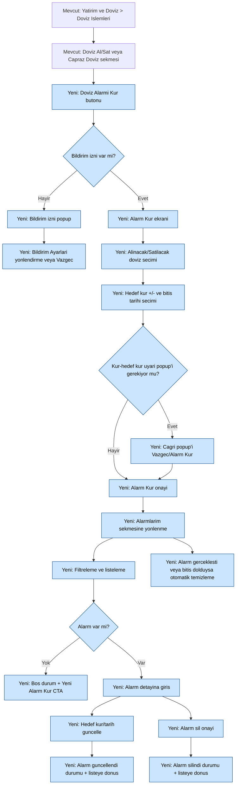

# 3535 Döviz Alarm
## İŞ ANALİZİ DOKÜMANI (ÜRÜN DOKÜMANTASYONU)
 
## Değişiklik Tarihçesi
 
| Tarih | Sürüm | Değişikliği Yapan | Değişiklik |
|-------|-------|-------------------|------------|
| 20 Mayıs 2026 | v1 | Raşit Şahin | Doküman oluşturuldu. |
 
## İçindekiler
 
1. Proje Genel Tanımı ve Amacı
2. Terimler ve Kısaltmalar
3. Müşteri Gereksinimleri
4. Yazılımın Fonksiyonel Gereksinimleri
5. Yazılımın Fonksiyonel Olmayan Gereksinimleri
 
## 1. Proje Genel Tanımı ve Amacı
 
Döviz Alarm geliştirmesi, müşterinin Yatırım ve Döviz > Döviz ve Kıymetli Maden İşlemleri akışı içinde döviz kuru hedefi tanımlayabilmesini, alarmı yönetebilmesini ve alarm gerçekleştiğinde push bildirim ile bilgilendirilmesini amaçlamaktadır. Geliştirme tipi kullanıcı beyanına göre sıfırdan yenidir; ancak çözüm mevcut Döviz Al/Sat ve Çapraz Döviz ekranlarına entegre biçimde ilerlemektedir. Bu nedenle analiz kapsamında mevcut döviz işlem ekranı davranışları ile yeni alarm davranışları birlikte ele alınmıştır.
 
Kapsam dökümanı ve paylaşılan ekran görüntülerine göre kullanıcı, Döviz Alarmı Kur butonu üzerinden alarm kurma ekranına geçebilmekte; alınacak/satılacak döviz seçimi, hedef kur, alarm bitiş tarihi, ters çevirme, doğrulama popup'ları, alarm listesi (Alarmlarım sekmesi), alarm silme ve alarm güncelleme adımlarını yönetebilmektedir. Ayrıca bildirim izni yoksa izin popup'ı gösterilmesi, ilk alarm sonrası Alarmlarım sekmesinin görünmesi, alarm gerçekleşme veya tarih aşımı sonrası alarmın otomatik temizlenmesi ve ilgili bilgilendirme metinlerinin sunulması kapsam dahilindedir.
 
Bu SDLC analiz dokümanı, yukarıdaki müşteri gereksinimlerinin mobil uygulama ekranları, akış, servis, menü, bildirim, loglama ve etki başlıkları altında yapılandırılmış şekilde değerlendirilmesini kapsar. Confluence kaynağı paylaşılmadığı için Confluence'a bağlı detaylar [BELIRSIZ] olarak işaretlenmiştir.
 
Figma node bazlı ekranlar üzerinden yapılan güncel doğrulama ile kapsam genişletilmiştir. Buna göre Alarm Kur ve Alarmlarım ana akışına ek olarak filtreleme, boş durum, işlem sonrası başarı durumları, alarm güncelleme/silme detay ekranı, tarih seçici (date picker), kur karşılaştırma uyarı popup'ı ve işlem sonrası otomatik yönlendirme davranışları da bu doküman kapsamında ele alınmaktadır.
 
## 2. Terimler ve Kısaltmalar
 
| Kısaltma / Terim | Açıklama |
|------------------|----------|
| Döviz Alarmı | Kullanıcının belirlediği hedef kura göre tetiklenen bildirim mekanizması. |
| Kur Gözlem | Döviz Al/Sat ve Çapraz Döviz sekmelerinin bulunduğu mevcut izleme ekranı. |
| Çapraz Döviz | TL içermeyen döviz çifti işlemleri (örnek: EUR/USD). |
| Hedef Kur | Alarm tetikleme eşiği olarak tanımlanan kur değeri. |
| Alarm Bitiş Tarihi | Alarmın geçerlilik süresini belirleyen son tarih alanı. |
| Alarmlarım | Oluşturulan alarmların listelendiği sekme. |
| PN (Push Notification) | Alarm gerçekleştiğinde gönderilecek mobil anlık bildirim. |
| Popup | Uyarı, onay veya bilgilendirme amaçlı açılır pencere. |
| Picker | Döviz cinsi veya işlem yönü seçiminde kullanılan seçim bileşeni. |
| Swipe | Alarm kartı üzerinde sola kaydırma ile silme aksiyonu. |
 
## 3. Müşteri Gereksinimleri
 
### 3.1 Gereksinimler
 
| Müşteri Gereksinimi | İlişkili Yazılım Gereksinimi |
|---------------------|------------------------------|
| Kullanıcı Döviz Al/Sat ve Çapraz Döviz ekranlarında Döviz Alarmı Kur butonu ile alarm akışına geçebilmelidir. | 4.1.1 |
| Bildirim izni yoksa kullanıcıya izin popup'ı gösterilmeli ve Bildirim Ayarları yönlendirmesi yapılmalıdır. | 4.1.2 |
| Kullanıcı Alarmlarım sekmesinde İşlem Yönü ve Döviz Cinsi filtreleri ile alarm listesini filtreleyebilmelidir. | 4.1.3 |
| Alınacak ve satılacak döviz seçimine göre kur bilgisi, hedef kur ve alarm bitiş tarihi alanları dinamik gösterilmelidir. | 4.1.3 |
| Aynı döviz seçimi veya işleme kapalı döviz çifti seçiminde kullanıcı uyarı popup'ı ile bilgilendirilmelidir. | 4.1.4 |
| Güncel kur hedef kurdan daha avantajlı olduğunda kullanıcıya onay popup'ı gösterilmeli, kullanıcı isterse yine alarm kurabilmelidir. | 4.1.5 |
| Alarm kurma sonrası Alarmlarım sekmesi görünmeli, alarm listesi filtrelenebilmeli, silme/güncelleme yapılabilmelidir. | 4.1.5 |
| Alarm kurma, güncelleme ve silme sonrası kullanıcıya başarı durum mesajı gösterilmeli ve ilgili liste ekranına yönlendirme yapılmalıdır. | 4.1.6 |
| Kullanıcı alarm detay ekranında hedef kuru +/- butonlarıyla ve bitiş tarihini tarih seçici ile değiştirebilmelidir. | 4.1.7 |
| Kullanıcı alarmı detay ekranından veya liste üzerinden silebilmeli; her iki akışta da onay popup'ı gösterilmelidir. | 4.1.8 |
| Alarm gerçekleştiğinde veya bitiş tarihi dolduğunda alarm otomatik kaldırılmalı; kullanıcı uygun metinle bilgilendirilmelidir. | 4.1.6 |
| Alarm listesi boş kaldığında kullanıcıya boş durum metni gösterilmeli, Yeni Alarm Kur CTA'sı erişilebilir kalmalıdır. | 4.1.9 |
 
### 3.2 Genel Süreç Akışı
 

 
### 3.3 Kapsama Alınmayan Müşteri Gereksinimleri
 
Kapsama alınmayan gereksinim bulunmamaktadır.
 
### 3.4 Etki ve Risk Analizi
 
#### 3.4.1 Kanal (ADK) Etkisi
QNB bireysel mobil bankacılık etkisi bulunmaktadır. Tüzel müşteri etkisi bulunmamaktadır.
 
#### 3.4.2 Engelsiz Bankacılık Etkisi
Internet veya Mobil uygulamalara etkisi yoktur.
 
#### 3.4.3 SAS Fraud Etkisi
SAS Fraud etkisi vardır. SAS log/mapping detayları geliştirici analiz dokümanında ve teknik tasarım adımında netleştirilecektir.
 
#### 3.4.4 Chatbot Etkisi
Chatbot etkisi bulunmamaktadır.
 
#### 3.4.5 CMS (Content Management System) Etkisi
 
| Key | tr-TR | en-US | ar-SA |
|-----|-------|-------|-------|
| CurrencyAlarmNoPermissionMessage | Bildirim izniniz bulunmuyor. Dilerseniz bildirim izni verdikten sonra alarm kurabilirsiniz. | [ÇEVİRİ GEREKLİ] | [ÇEVİRİ GEREKLİ] |
| CurrencyAlarmInfoCardMessage | Alarmlarınız gerçekleştiğinde veya bitiş tarihine kadar gerçekleşmediği durumda otomatik olarak silinecektir. | [ÇEVİRİ GEREKLİ] | [ÇEVİRİ GEREKLİ] |
| CurrencyAlarmNotFoundMessage | Alarmınız bulunmuyor. | [ÇEVİRİ GEREKLİ] | [ÇEVİRİ GEREKLİ] |
| CurrencyAlarmCreatedToast | Alarmınızı kurduk. | [ÇEVİRİ GEREKLİ] | [ÇEVİRİ GEREKLİ] |
| CurrencyAlarmUpdatedToast | Alarmınızı güncelledik. | [ÇEVİRİ GEREKLİ] | [ÇEVİRİ GEREKLİ] |
| CurrencyAlarmDeletedToast | Alarmı sildiniz. | [ÇEVİRİ GEREKLİ] | [ÇEVİRİ GEREKLİ] |
| CurrencyAlarmDeleteConfirm | Alarmı silmek istediğinize emin misiniz? | [ÇEVİRİ GEREKLİ] | [ÇEVİRİ GEREKLİ] |
| CurrencyAlarmCrossRateWarning | Güncel <döviz cinsi> kuru şu anda belirlediğiniz hedef kurdan daha <düşük / yüksek>. Dilerseniz döviz işleminizi hemen daha avantajlı fiyattan gerçekleştirebilirsiniz. | [ÇEVİRİ GEREKLİ] | [ÇEVİRİ GEREKLİ] |
| CurrencyAlarmCrossRateQuestion | Yine de alarm kurmak istiyor musunuz? | [ÇEVİRİ GEREKLİ] | [ÇEVİRİ GEREKLİ] |
 
#### 3.4.6 TTS (OSDEM-SDY) ve DYS (FOMER) Etkisi
TTS-DYS etkisi bulunmamaktadır.
 
#### 3.4.7 MDYS Tanımları
MDYS etkisi bulunmamaktadır.
 
#### 3.4.8 Mevzuata Uyum
Banka Proje sorumlusu [BELIRSIZ] tarafından mevzuat uyum durumu Yasal Uyum biriminden sorgulanmış olup, iş isteği kapsamında mevzuata uyulması için yapılması gereken bir geliştirme bulunmadığı iletilmiştir.
 
#### 3.4.9 Anomali Takibi
Anomali takibi ihtiyacı bulunmamaktadır.
 
#### 3.4.10 Mobil ve IB Uygulamaları EBHS Etkisi
EBHS etkisi bulunmamaktadır.
 
## 4. Yazılımın Fonksiyonel Gereksinimleri
 
### 4.1 Yazılım İşlevleri
 
Bu geliştirme, mevcut Döviz İşlemleri ekranı üzerine alarm yeteneğinin eklenmesini kapsayan dokuz ana yazılım işlevinden oluşmaktadır. Figma ekranlarına göre Döviz Al/Sat, Çapraz Döviz ve Alarmlarım sekmeleri bir bütün akış olarak ele alınmış; liste/filtre, boş durum, güncelle-sil popup'ları, çapraz kur uyarı popup'ı ve işlem sonrası durum mesajları kapsam içine dahil edilmiştir. Erişim noktaları Döviz Al/Sat sekmesi, Çapraz Döviz sekmesi, Alarmlarım sekmesi ve ana menü arama yönlendirmesi olarak belirlenmiştir. Pilot kontrolü ve yeni HPC ihtiyacı bulunduğu için menü konfigürasyonu, sürüm etkisi ve servis katmanı birlikte değerlendirilmiştir.
 
#### 4.1.1 Alarm Gözlem Sekmesi Yazılım İşlevi
 
Mevcut Döviz İşlemleri ekranında Döviz Alarmı Kur giriş noktası, kur liste kartlarının bulunduğu içerik alanında, "Son güncelleme saati" satırının hemen altında ve ilk kur satırının hemen üstünde konumlandırılır. Aynı yerleşim kuralı Döviz Al/Sat ve Çapraz Döviz sekmeleri için ayrı ayrı uygulanır.
 
Sekme görünürlük kuralları aşağıdaki sırayla uygulanır:
 
1. Kullanıcının aktif alarm kaydı sorgulanır.
2. Aktif alarm kaydı yoksa Alarmlarım sekmesi gösterilmez.
3. Kullanıcı ilk alarmını başarıyla oluşturduktan sonra Alarmlarım sekmesi gösterilir.
4. Kullanıcı tüm alarmları silse bile Alarmlarım sekmesi görünür kalır; sekme içinde boş durum metni gösterilir.
 
**4.1.1 Karar Matrisi**
 
| Analiz Edilecek Başlıklar | Evet/Hayır | Not |
|---------------------------|------------|-----|
| Yeni ekran tasarımı veya mevcut ekranda değişiklik var mı? | Evet | Mevcut kur gözlem ekranına alarm girişi eklenir |
| Yeni batch veya mevcut batchlerde değişiklik var mı? | Hayır | Mobil kapsamda batch tanımı bulunmamaktadır |
| Yeni bir çıktı/rapor veya değişiklik var mı? | Hayır | Ek çıktı/rapor yok |
| Yeni menü tanımlanacak mı? | Evet | Alarm giriş butonu ve sekme görünürlüğü etkilenir |
| Yeni bir servis tanımı olacak mı? | Evet | Alarm liste/görünürlük kontrol servis çağrısı gerekir |
| Erişim noktaları analiz edilecek mi? | Evet | Döviz Al/Sat ve Çapraz Döviz girişleri |
| SMS/PN bilgilendirme tanımı olacak mı? | Hayır | Bu alt işlevde doğrudan bildirim yok |
| E-mail bilgilendirme tanımı olacak mı? | Hayır | E-Mail gereksinimi bulunmamaktadır |
| Memo ve ekstre tanımı olacak mı? | Hayır | Memo/ekstre gereksinimi bulunmamaktadır |
| Uyarı ve hata mesajı tanımı olacak mı? | Hayır | Bu adımda popup tetiklenmez |
| Yapılacak değişikliğin etki analizi var mı? | Evet | Kanal ve CMS etkisi vardır |
 
#### 4.1.2 Bildirim İzni Kontrolü Yazılım İşlevi
 
Bildirim izni kontrolü ekran açılışında değil, yalnızca kullanıcı Döviz Alarmı Kur butonuna bastığı anda tetiklenir.
 
Akış kuralları aşağıdaki gibidir:
 
1. Kullanıcı Döviz Alarmı Kur butonuna basar.
2. Cihaz bildirim izni kontrol edilir.
3. Bildirim izni yoksa popup açılır.
4. Popup metni: "Bildirim izniniz bulunmuyor. Dilerseniz bildirim izni verdikten sonra alarm kurabilirsiniz."
5. Popup butonları: "Vazgeç" ve "Bildirim Ayarları".
6. Kullanıcı "Vazgeç" butonuna basarsa popup kapanır ve kullanıcı mevcut ekranda kalır.
7. Kullanıcı "Bildirim Ayarları" butonuna basarsa uygulamanın işletim sistemi bildirim ayarları sayfasına yönlendirme yapılır.
8. Bildirim izni varsa popup gösterilmez ve kullanıcı doğrudan Yeni Alarm Kur ekranına ilerler.
 
**4.1.2 Karar Matrisi**
 
| Analiz Edilecek Başlıklar | Evet/Hayır | Not |
|---------------------------|------------|-----|
| Yeni ekran tasarımı veya mevcut ekranda değişiklik var mı? | Evet | Bildirim izin popup akışı eklenir |
| Yeni batch veya mevcut batchlerde değişiklik var mı? | Hayır | Batch etkisi yok |
| Yeni bir çıktı/rapor veya değişiklik var mı? | Hayır | Rapor etkisi yok |
| Yeni menü tanımlanacak mı? | Hayır | Menü tanımı değişmez |
| Yeni bir servis tanımı olacak mı? | Hayır | OS seviyesinde izin kontrolü yapılır |
| Erişim noktaları analiz edilecek mi? | Evet | Alarm kur girişinde izin kontrol noktası |
| SMS/PN bilgilendirme tanımı olacak mı? | Hayır | Bu adımda sadece izin kontrolü var |
| E-mail bilgilendirme tanımı olacak mı? | Hayır | E-Mail gereksinimi bulunmamaktadır |
| Memo ve ekstre tanımı olacak mı? | Hayır | Memo/ekstre gereksinimi bulunmamaktadır |
| Uyarı ve hata mesajı tanımı olacak mı? | Evet | Bildirim izni popup metni bulunur |
| Yapılacak değişikliğin etki analizi var mı? | Evet | CMS metin ve kullanıcı deneyimi etkisi vardır |
 
#### 4.1.3 Yeni Alarm Kur Yazılım İşlevi
 
Kullanıcı alınacak ve satılacak döviz cinslerini picker ile seçer, ters çevirme butonu ile seçimleri yer değiştirir, hedef kur alanını +/- adımlarıyla günceller ve alarm bitiş tarihini seçer. TL içeren paritelerde tek döviz gösterimi, çapraz dövizde çift döviz/parite gösterimi uygulanır. Hedef kur ve güncel kur ilişkisine göre uyarı popup'ı ile kullanıcı onayı alınır.
 
Alarm kur ekranında buton durumu, alan validasyonu ve seçilen pariteye bağlı metin dinamik olarak değişir. Alarm Bitiş Tarihi alanı takvim bileşeni ile yönetilir. Kullanıcı tarih seçimini değiştirdiğinde ve hedef kur alanı güncellendiğinde Alarm Kur aksiyonu tekrar değerlendirilir.
 
**4.1.3 Karar Matrisi**
 
| Analiz Edilecek Başlıklar | Evet/Hayır | Not |
|---------------------------|------------|-----|
| Yeni ekran tasarımı veya mevcut ekranda değişiklik var mı? | Evet | Yeni Alarm Kur ekranı ve alanları bulunur |
| Yeni batch veya mevcut batchlerde değişiklik var mı? | Hayır | Batch etkisi yok |
| Yeni bir çıktı/rapor veya değişiklik var mı? | Hayır | Rapor etkisi yok |
| Yeni menü tanımlanacak mı? | Hayır | Mevcut akış içi ekran |
| Yeni bir servis tanımı olacak mı? | Evet | Alarm oluşturma servis çağrısı gerekir |
| Erişim noktaları analiz edilecek mi? | Evet | Döviz Al/Sat, Çapraz Döviz ve Alarmlarım CTA |
| SMS/PN bilgilendirme tanımı olacak mı? | Evet | Alarm kurulum sonrası bildirim senaryosu vardır |
| E-mail bilgilendirme tanımı olacak mı? | Hayır | E-Mail gereksinimi bulunmamaktadır |
| Memo ve ekstre tanımı olacak mı? | Hayır | Memo/ekstre gereksinimi bulunmamaktadır |
| Uyarı ve hata mesajı tanımı olacak mı? | Evet | Alan doğrulama ve kur karşılaştırma mesajları vardır |
| Yapılacak değişikliğin etki analizi var mı? | Evet | Kanal, CMS, log, dil etkisi vardır |
 
#### 4.1.4 Alarm Listeleme ve Filtreleme Yazılım İşlevi
 
Alarmlarım sekmesinde İşlem Yönü ve Döviz Cinsi filtreleriyle liste daraltılır. Liste elemanında döviz çifti veya döviz cinsi, hedef kur tipi (alış/satış), hedef kur değeri ve bitiş tarihi gösterilir. Kullanıcı liste satırına tıklayarak detay ekranına gider.
 
**4.1.4 Karar Matrisi**
 
| Analiz Edilecek Başlıklar | Evet/Hayır | Not |
|---------------------------|------------|-----|
| Yeni ekran tasarımı veya mevcut ekranda değişiklik var mı? | Evet | Alarmlarım filtre ve liste bileşenleri eklenir |
| Yeni batch veya mevcut batchlerde değişiklik var mı? | Hayır | Batch etkisi yok |
| Yeni bir çıktı/rapor veya değişiklik var mı? | Hayır | Rapor etkisi yok |
| Yeni menü tanımlanacak mı? | Evet | Alarmlarım sekmesi görünür hale gelir |
| Yeni bir servis tanımı olacak mı? | Evet | Listeleme ve filtre servis çağrıları gerekir |
| Erişim noktaları analiz edilecek mi? | Evet | Alarmlarım sekmesi ve liste satırı geçişi |
| SMS/PN bilgilendirme tanımı olacak mı? | Hayır | Listeleme adımında bildirim yok |
| E-mail bilgilendirme tanımı olacak mı? | Hayır | E-Mail gereksinimi bulunmamaktadır |
| Memo ve ekstre tanımı olacak mı? | Hayır | Memo/ekstre gereksinimi bulunmamaktadır |
| Uyarı ve hata mesajı tanımı olacak mı? | Hayır | Bu adımda uyarı popup zorunlu değildir |
| Yapılacak değişikliğin etki analizi var mı? | Evet | Kullanım analitiği ve performans etkisi vardır |
 
#### 4.1.5 Alarm Validasyonları ve Kur Uyarısı Yazılım İşlevi
 
Aynı döviz seçimi ve işleme kapalı döviz çifti seçimlerinde kullanıcıya doğrulama popup'ı gösterilir. Bu popup'lar işlem devamını engeller ve kullanıcıyı aynı ekranda tutar. Kur-hedef kur karşılaştırmalarında da işlem öncesi onay popup'ı zorunludur.
 
Çapraz satış uyarı popup'ı iki aksiyon içerir: Vazgeç ve Alarm Kur. Kullanıcı Vazgeç seçerse alarm kurulmaz; Alarm Kur seçerse akış onay adımına devam eder.
 
Kur karşılaştırma popup metinleri aşağıdaki şekilde gösterilir:
 
1. Ana metin: "Güncel <döviz cinsi> kuru şu anda belirlediğiniz hedef kurdan daha <düşük / yüksek>. Dilerseniz döviz işleminizi hemen daha avantajlı fiyattan gerçekleştirebilirsiniz."
2. Soru metni: "Yine de alarm kurmak istiyor musunuz?"
3. Butonlar: "Vazgeç" ve "Alarm Kur".
 
Seçim sonucuna göre davranış:
 
1. Kullanıcı "Vazgeç" butonuna basarsa popup kapanır ve alarm oluşturma işlemi sonlandırılır.
2. Kullanıcı "Alarm Kur" butonuna basarsa alarm oluşturma işlemi devam eder.
 
**4.1.5 Karar Matrisi**
 
| Analiz Edilecek Başlıklar | Evet/Hayır | Not |
|---------------------------|------------|-----|
| Yeni ekran tasarımı veya mevcut ekranda değişiklik var mı? | Evet | Kur uyarı popup ve validasyon popup ekranları eklenir |
| Yeni batch veya mevcut batchlerde değişiklik var mı? | Hayır | Batch etkisi yok |
| Yeni bir çıktı/rapor veya değişiklik var mı? | Hayır | Rapor etkisi yok |
| Yeni menü tanımlanacak mı? | Hayır | Menü değişikliği bulunmaz |
| Yeni bir servis tanımı olacak mı? | Hayır | Karar client validasyon + mevcut kur verisiyle verilir |
| Erişim noktaları analiz edilecek mi? | Evet | Alarm kur akışı içi validasyon noktaları |
| SMS/PN bilgilendirme tanımı olacak mı? | Hayır | Bu adımda bildirim gönderimi yok |
| E-mail bilgilendirme tanımı olacak mı? | Hayır | E-Mail gereksinimi bulunmamaktadır |
| Memo ve ekstre tanımı olacak mı? | Hayır | Memo/ekstre gereksinimi bulunmamaktadır |
| Uyarı ve hata mesajı tanımı olacak mı? | Evet | Çapraz satış kur uyarısı ve doğrulama popup'ları vardır |
| Yapılacak değişikliğin etki analizi var mı? | Evet | CMS metin ve kullanıcı davranışı etkisi vardır |
 
#### 4.1.6 İşlem Sonrası Durum Mesajları Yazılım İşlevi
 
Alarm kurma, güncelleme ve silme işlemleri sonrası kullanıcıya kısa süreli durum mesajı gösterilir. Bu dokümanda "toast" terimi, ekran üzerinde kısa süre görünen ve kullanıcıdan ek aksiyon istemeyen durum mesajı anlamında kullanılır.
 
Mesaj ve yönlendirme kuralları aşağıdaki gibidir:
 
1. Alarm oluşturma başarılıysa "Alarmınızı kurduk." mesajı gösterilir ve kullanıcı Alarmlarım sekmesine yönlendirilir.
2. Alarm güncelleme başarılıysa "Alarmınızı güncelledik" mesajı gösterilir ve kullanıcı Alarmlarım sekmesine yönlendirilir.
3. Alarm silme başarılıysa "Alarmı sildiniz" mesajı gösterilir ve kullanıcı Alarmlarım sekmesine yönlendirilir.
4. Durum mesajı görünümü kapanınca liste ekranı güncel verilerle yeniden yüklenmiş durumda kalır.
 
**4.1.6 Karar Matrisi**
 
| Analiz Edilecek Başlıklar | Evet/Hayır | Not |
|---------------------------|------------|-----|
| Yeni ekran tasarımı veya mevcut ekranda değişiklik var mı? | Evet | Başarı durum kartları ve geri dönüş davranışı eklenir |
| Yeni batch veya mevcut batchlerde değişiklik var mı? | Hayır | Batch etkisi yok |
| Yeni bir çıktı/rapor veya değişiklik var mı? | Hayır | Rapor etkisi yok |
| Yeni menü tanımlanacak mı? | Hayır | Menü değişikliği yok |
| Yeni bir servis tanımı olacak mı? | Hayır | Servis çağrısı işleme bağlıdır, durum kartı UI davranışıdır |
| Erişim noktaları analiz edilecek mi? | Evet | İşlem sonrası listeye geri dönüş noktası |
| SMS/PN bilgilendirme tanımı olacak mı? | Hayır | Bu adım görsel durum mesajıdır |
| E-mail bilgilendirme tanımı olacak mı? | Hayır | E-Mail gereksinimi bulunmamaktadır |
| Memo ve ekstre tanımı olacak mı? | Hayır | Memo/ekstre gereksinimi bulunmamaktadır |
| Uyarı ve hata mesajı tanımı olacak mı? | Evet | Kuruldu/Güncellendi/Silindi durum mesajları vardır |
| Yapılacak değişikliğin etki analizi var mı? | Evet | UX ve loglama etkisi vardır |
 
#### 4.1.7 Alarm Detay Güncelleme Yazılım İşlevi
 
Kullanıcı alarm detay ekranında hedef kuru +/- butonlarıyla günceller, bitiş tarihini tarih seçiciyle değiştirir ve Alarmı Güncelle aksiyonunu çalıştırır. Ekranda değişiklik yapılmadığında güncelle butonu pasif, değişiklik sonrası aktif davranır.
 
**4.1.7 Karar Matrisi**
 
| Analiz Edilecek Başlıklar | Evet/Hayır | Not |
|---------------------------|------------|-----|
| Yeni ekran tasarımı veya mevcut ekranda değişiklik var mı? | Evet | Alarm detay ve tarih seçici ekranı bulunur |
| Yeni batch veya mevcut batchlerde değişiklik var mı? | Hayır | Batch etkisi yok |
| Yeni bir çıktı/rapor veya değişiklik var mı? | Hayır | Rapor etkisi yok |
| Yeni menü tanımlanacak mı? | Hayır | Mevcut akış içi detay ekranı |
| Yeni bir servis tanımı olacak mı? | Evet | Alarm güncelleme servis çağrısı gerekir |
| Erişim noktaları analiz edilecek mi? | Evet | Liste satırı -> detay -> güncelle akışı |
| SMS/PN bilgilendirme tanımı olacak mı? | Hayır | Güncelleme adımında doğrudan bildirim yok |
| E-mail bilgilendirme tanımı olacak mı? | Hayır | E-Mail gereksinimi bulunmamaktadır |
| Memo ve ekstre tanımı olacak mı? | Hayır | Memo/ekstre gereksinimi bulunmamaktadır |
| Uyarı ve hata mesajı tanımı olacak mı? | Evet | Güncelle sonrası durum mesajı ve validasyon bulunur |
| Yapılacak değişikliğin etki analizi var mı? | Evet | Servis, log, CMS metin etkisi vardır |
 
#### 4.1.8 Alarm Silme Yazılım İşlevi
 
Kullanıcı alarmı detay ekranından veya liste üzerinden silebilir. Her iki senaryoda da aynı onay popup'ı gösterilir.
 
Popup içeriği ve davranış:
 
1. Popup metni: "Alarmı silmek istediğinize emin misiniz?"
2. Butonlar: "Vazgeç" ve "Evet".
3. Kullanıcı "Vazgeç" butonuna basarsa popup kapanır, alarm kaydı değişmeden kalır.
4. Kullanıcı "Evet" butonuna basarsa alarm silinir, "Alarmı sildiniz" durum mesajı gösterilir ve kullanıcı Alarmlarım sekmesine yönlendirilir.
 
**4.1.8 Karar Matrisi**
 
| Analiz Edilecek Başlıklar | Evet/Hayır | Not |
|---------------------------|------------|-----|
| Yeni ekran tasarımı veya mevcut ekranda değişiklik var mı? | Evet | Silme onay popup akışları vardır |
| Yeni batch veya mevcut batchlerde değişiklik var mı? | Hayır | Batch etkisi yok |
| Yeni bir çıktı/rapor veya değişiklik var mı? | Hayır | Rapor etkisi yok |
| Yeni menü tanımlanacak mı? | Hayır | Menü değişikliği yok |
| Yeni bir servis tanımı olacak mı? | Evet | Alarm silme servis çağrısı gerekir |
| Erişim noktaları analiz edilecek mi? | Evet | Liste üzerinden swipe ve detay üzerinden silme |
| SMS/PN bilgilendirme tanımı olacak mı? | Hayır | Silme adımında bildirim tanımı yok |
| E-mail bilgilendirme tanımı olacak mı? | Hayır | E-Mail gereksinimi bulunmamaktadır |
| Memo ve ekstre tanımı olacak mı? | Hayır | Memo/ekstre gereksinimi bulunmamaktadır |
| Uyarı ve hata mesajı tanımı olacak mı? | Evet | Silme onay popup ve silindi durumu vardır |
| Yapılacak değişikliğin etki analizi var mı? | Evet | Servis, log ve CMS metin etkisi vardır |
 
#### 4.1.9 Boş Durum ve Süre Sonu Yönetimi Yazılım İşlevi
 
Kullanıcının aktif alarmı kalmadığında Alarmlarım sekmesinde boş durum metni gösterilir ve Yeni Alarm Kur butonu erişilebilir kalır. Alarm gerçekleştiğinde veya bitiş tarihi dolduğunda otomatik temizleme yapılır ve bilgi kartı mesajı gösterilir.
 
**4.1.9 Karar Matrisi**
 
| Analiz Edilecek Başlıklar | Evet/Hayır | Not |
|---------------------------|------------|-----|
| Yeni ekran tasarımı veya mevcut ekranda değişiklik var mı? | Evet | Boş durum görünümü ve bilgi kartı gösterimi vardır |
| Yeni batch veya mevcut batchlerde değişiklik var mı? | Hayır | Batch etkisi yok |
| Yeni bir çıktı/rapor veya değişiklik var mı? | Hayır | Rapor etkisi yok |
| Yeni menü tanımlanacak mı? | Hayır | Mevcut Alarmlarım sekmesi içinde davranış |
| Yeni bir servis tanımı olacak mı? | Evet | Süre sonu/gerçekleşme sonrası liste güncelleme çağrısı gerekir |
| Erişim noktaları analiz edilecek mi? | Evet | Boş durumdan Yeni Alarm Kur CTA dönüşü |
| SMS/PN bilgilendirme tanımı olacak mı? | Evet | Alarm gerçekleşme PN davranışı bu işlevle ilişkilidir |
| E-mail bilgilendirme tanımı olacak mı? | Hayır | E-Mail gereksinimi bulunmamaktadır |
| Memo ve ekstre tanımı olacak mı? | Hayır | Memo/ekstre gereksinimi bulunmamaktadır |
| Uyarı ve hata mesajı tanımı olacak mı? | Evet | Boş durum metni ve otomatik silme bilgi kartı vardır |
| Yapılacak değişikliğin etki analizi var mı? | Evet | Kullanıcı deneyimi, loglama ve bildirim etkisi vardır |
 
#### 4.1 Karar Matrisi (Özet)
 
| Analiz Edilecek Başlıklar | Evet/Hayır | Not |
|---------------------------|------------|-----|
| Yeni ekran tasarımı veya mevcut ekranda değişiklik var mı? | Evet | Mevcut ekrana alarm sekmeleri ve yeni ekranlar ekleniyor |
| Yeni batch veya mevcut batchlerde değişiklik var mı? | Hayır | Mobil kapsamda batch tanımı bulunmamaktadır |
| Yeni bir çıktı/rapor veya değişiklik var mı? | Hayır | Ek çıktı/rapor gereksinimi tanımlanmadı |
| Yeni menü tanımlanacak mı? | Evet | Ana menü arama yönlendirmesi ve alarm giriş erişimi olacak |
| Yeni bir servis tanımı olacak mı? | Evet | Yeni HPC ihtiyacı ile servis tanımı bekleniyor |
| Erişim noktaları analiz edilecek mi? | Evet | Döviz Al/Sat, Çapraz Döviz, Alarmlarım, menü arama |
| SMS/PN bilgilendirme tanımı olacak mı? | Evet | SMS ve PN birlikte kullanılacak |
| E-mail bilgilendirme tanımı olacak mı? | Hayır | E-Mail bilgilendirme gereksinimi bulunmamaktadır |
| Memo ve ekstre tanımı olacak mı? | Hayır | Memo/ekstre gereksinimi bulunmamaktadır |
| Uyarı ve hata mesajı tanımı olacak mı? | Evet | İzin popup'ı, silme popup'ı, çapraz kur uyarı popup'ı ve validasyon mesajları mevcut |
| Yapılacak değişikliğin etki analizi var mı? | Evet | Kanal, SAS, CMS, log ve dil etkisi bulunmaktadır |
 
#### 4.1 Derinleştirme Kararları
 
| Soru | Karar |
|------|-------|
| Segmente göre farklılık olacak mı? | Yok (tüm segmentlerde aynı) |
| Yeni HPC tanımlanmalı mı? | Evet |
| Pilot kontrolü yapılacak mı? | Evet |
| Eski client etkisi var mı? | Evet |
| Force update ihtiyacı var mı? | Yok |
| TrackMobileEvent loglama ihtiyacı var mı? | Evet |
| SAS loglama ihtiyacı var mı? | Evet |
| Dataroid etkisi var mı? | Var |
| Adjust etkisi var mı? | Var |
| Kart maskeleme ihtiyacı var mı? | Yok |
| İngilizce ve Arapça menülere etki var mı? | Var |
 
#### 4.1 Evet/Hayır Yoğunluk Özeti
 
Bu özet, 4.1.1-4.1.9 alt işlevlerinin karar matrislerinden otomatik olarak derlenmiş görünümüdür. Toplam 9 işlev x 11 karar satırı olmak üzere 99 karar değerlendirilmiştir.
 
**İşlev Bazlı Yoğunluk**
 
| İşlev | Evet | Hayır | Yoğunluk |
|------|------|-------|----------|
| 4.1.1 Alarm Gözlem Sekmesi | 5 | 6 | Orta |
| 4.1.2 Bildirim İzni Kontrolü | 4 | 7 | Düşük-Orta |
| 4.1.3 Yeni Alarm Kur | 6 | 5 | Yüksek |
| 4.1.4 Alarm Listeleme ve Filtreleme | 5 | 6 | Orta |
| 4.1.5 Alarm Validasyonları ve Kur Uyarısı | 4 | 7 | Düşük-Orta |
| 4.1.6 İşlem Sonrası Durum Mesajları | 4 | 7 | Düşük-Orta |
| 4.1.7 Alarm Detay Güncelleme | 5 | 6 | Orta |
| 4.1.8 Alarm Silme | 5 | 6 | Orta |
| 4.1.9 Boş Durum ve Süre Sonu Yönetimi | 6 | 5 | Yüksek |
| **Toplam** | **44** | **55** | **44/99 = %44 Evet** |
 
**Başlık Bazlı Yoğunluk**
 
| Karar Başlığı | Evet Sayısı (9 işlevde) | Not |
|--------------|--------------------------|-----|
| Ekran Tasarımı / Mevcut Ekran Değişikliği | 9 | Tüm işlevlerde ekran etkisi var |
| Batch Değişikliği | 0 | Mobil kapsamda batch etkisi yok |
| Çıktı / Rapor | 0 | Ek rapor gereksinimi yok |
| Menü Tanımı | 2 | Sadece giriş/sekme davranışı etkilenen işlevlerde var |
| Servis Tanımı | 6 | Oluşturma/listeleme/güncelleme/silme/süre sonu servis etkisi |
| Erişim Noktaları | 9 | Tüm işlevlerde erişim adımı bulunuyor |
| SMS/PN Bilgilendirme | 2 | Alarm kur ve süre sonu yönetimi işlevlerinde belirgin |
| E-Mail Bilgilendirme | 0 | E-mail gereksinimi bulunmuyor |
| Memo / Ekstre | 0 | Memo/ekstre gereksinimi bulunmuyor |
| Uyarı / Hata Mesajları | 7 | Popup ve durum mesajı yoğunluğu yüksek |
| Etki Analizi | 9 | Tüm işlevlerde etki değerlendirmesi gerekli |
 
### 4.2 Muhasebe, Dekont, Alındılar ve Sistem Mizan
Muhasebe, Dekont, Alındılar ve Sistem Mizan etkisi yoktur.
 
### 4.3 Log ve EDW Rapor Gereksinimleri
 
#### 4.3.1 Loglama
EDW Extra Field ve Contact History loglama ihtiyacı bulunmaktadır. Buna ek olarak TrackMobileEvent loglaması ve SAS log gönderimi ihtiyaç olarak işaretlenmiştir. İşlem bazında en az alarm oluşturma, alarm güncelleme, alarm silme, filtre değişikliği, popup aksiyonu (Vazgeç/Onay) ve PN tıklama ile derin link yönlenmesi olaylarının loglanması önerilmektedir. Ürün İşlem/ADK/Teftiş logları için ek ihtiyaç bu aşamada tanımlanmamıştır.
 
#### 4.3.2 EDW Raporları
EDW raporlama ihtiyacı bulunmamaktadır.
 
### 4.4 Ürün ve Ürün İşlem Tanım Gereksinimleri
Ürün ve ürün işlem etkisi bulunmamaktadır.
 
## 5. Yazılımın Fonksiyonel Olmayan Gereksinimleri
 
### 5.1 Performans, Kapasite ve Erişilebilirlik
Performans, kapasite ve erişilebilirlik etkisi bulunmamaktadır.
 
### 5.2 Güvenlik ve Veri Gizliliği
Güvenlik ihtiyacı Ibtech-Information Security Management Ekibi tarafından yazılım projeleri için Jira, altyapı projeleri için KYS'de kayıt altına alınır.
 
### 5.3 Güvenilirlik ve Yedeklilik
Güvenilirlik ve yedeklilik etkisi bulunmamaktadır.
 
### 5.4 Erişim ve Kimlik Yönetimi
Erişim ve kimlik yönetimi için mevcut kurallar geçerli olacaktır.
 
### 5.5 İç Sistemler Görüşü
İç sistem görüşü aşağıda paylaşılmıştır.
 
| Görüş Alınan Tarih | Görüş Alınan Kişi | Görüş Detayı |
|--------------------|-------------------|--------------|
| [BELIRSIZ] | [BELIRSIZ] | [BELIRSIZ] |
 
## Hata ve Belirsizlik Raporu (Otomatik)
 
| # | Tip | Detay | Yeri | Etki |
|---|-----|-------|------|------|
| 1 | [KISMI] | Figma node bazlı doğrulama yapıldı; ancak tüm teknik alan adları kod/deploy ortamından doğrulanmadı. | 3.4.5, 4.1, 4.3 | Metin/akış kapsamı genişledi, teknik entegrasyon isimleri kısmi kaldı |
| 2 | [BELIRSIZ] | Confluence kaynağı paylaşılmadı. | 1, 3.4.8 | Mevzuat uyum teyidi veren sorumlu kişi doğrulanamadı |
| 3 | [BELIRSIZ] | Teknik servis/transaction isimleri, HPC değeri ve SMS/PN form kodları henüz doğrulanmadı. | 4.1, 4.3 | Teknik tasarım ve test kapsamı kısmi belirsiz kaldı |